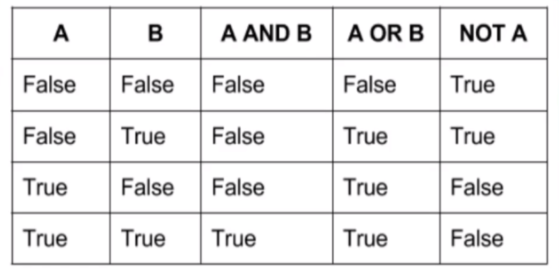

# JavaScript do básico ao avançado (c/ Node.js e projetos)

https://www.udemy.com/course/javascript-do-basico-ao-avancado-com-node-e-projetos/

Aprenda tudo sobre JavaScript(ES6+), lógica de prog., orientação a objetos, crie projetos para web com Node.js e Express

## <a name="indice">Índice</a>

1. [Seção 01: Introdução](#parte1)     
2. [Seção 02: Tipos de dado e operadores lógicos](#parte2)     
3. [Seção 03: Exercícios sobre tipos de dados](#parte3)     
4. [Seção 04: Estruturas de Programação](#parte4)     
5. [Seção 05: Exercícios sobre estrutura de programação](#parte5)     
6. [Seção 06: Funções](#parte6)     
7. [Seção 07: Exercícios sobre funções](#parte7)     
8. [Seção 08: Arrays e Objetos](#parte8)     
9. [Seção 09: Exercícios sobre arrays e objetos](#parte9)     
10. [Seção 10: Conceitos de orientação a objetos](#parte10)     
11. [Seção 11: Exercícios sobre orientação a objetos](#parte11)     
12. [Seção 12: Debugs e erros no JavaScript](#parte12)     
13. [Seção 13: Expressões Regulares](#parte13)     
14. [Seção 14: Exercícios sobre Expressões Regulares](#parte14)     
15. [Seção 15: Programação Assíncrona com JavaScript](#parte15)     
16. [Seção 16: JavaScript e o navegador](#parte16)     
17. [Seção 17: Eventos com JavaScript](#parte17)     
18. [Seção 18: Projeto 1: Jogo da Velha (HTML, CSS, DOM e eventos)](#parte18)     
19. [Seção 19: Aprendendo Node.js](#parte19)     
20. [Seção 20: Projeto com Node, Express, Sequelize: Job Finder](#parte20)     
21. [Seção 21: Projeto 3: Quizz com Vanilla JS (Manipulação e eventos de DOM)](#parte21)     
---


## <a name="parte1">1 - Seção 01: Introdução</a>

1. Apresentação do curso

2. Introdução

3. O que é JavaScript?

4. Onde o JavaScript é utilizado?

5. Fazendo download do VSCode (editor de texto utilizado no curso)

6. Como executar JS no navegador por arquivo

7. Como executar JS diretamente no navegador

8. Maneira alterantiva de executar JS

9. Como pesquisar problemas/dúvidas de código no Stackoverflow

10. Como pesquisar problemas/dúvidas de código no Google

11. Minha sugestão para você acompanhar o curso

12. Slides do Curso

13. Conclusão da seção

14. Arquivos do curso

[Voltar ao Índice](#indice)

---


## <a name="parte2">2 - Seção 02: Tipos de dado e operadores lógicos</a>

15. Introdução da seção

16. O que são tipos de dados?

17. Tipo de dado: number

- [Secao-02-Tipos-de-dado-e-operadores-logicos/17-Tipo-de-dado-number.js](Secao-02-Tipos-de-dado-e-operadores-logicos/17-Tipo-de-dado-number.js)

```javascript
console.log(typeof 5)
console.log(typeof 12.6)
console.log(typeof -12)
/*
number
number
number
*/

```

18. Operações aritméticas com number

- [Secao-02-Tipos-de-dado-e-operadores-logicos/18-Operacoes-aritmeticas-com-number.js](Secao-02-Tipos-de-dado-e-operadores-logicos/18-Operacoes-aritmeticas-com-number.js)

```javascript
console.log((2 + 3));
console.log((5 - 12));
console.log((4 * 4));
console.log((5 / 3));
console.log((20 % 2));
console.log((21 % 2));
console.log(typeof (2 + 3));
console.log(typeof (5 - 12));
console.log(typeof (4 * 4));
console.log(typeof (5 / 3));
console.log(typeof (20 % 2));
console.log(typeof (21 % 2));
/*
5
-7
16
1.6666666666666667
0
1
number
number
number
number
number
number
*/

```

19. Conhecendo os special numbers

- [Secao-02-Tipos-de-dado-e-operadores-logicos/19-Conhecendo-os-special-numbers.js](Secao-02-Tipos-de-dado-e-operadores-logicos/19-Conhecendo-os-special-numbers.js)

```javascript
console.log(Infinity);
console.log(-Infinity);
console.log(NaN);
console.log(typeof Infinity);
console.log(typeof -Infinity);
console.log(typeof NaN);
/*
Infinity
-Infinity
NaN
number
number
number
*/
```

20. Tipo de dado: string

- [Secao-02-Tipos-de-dado-e-operadores-logicos/20-Tipo-de-dado-string.js](Secao-02-Tipos-de-dado-e-operadores-logicos/20-Tipo-de-dado-string.js)

```javascript
console.log("Oi, meu nome é Matheus");
console.log('Eu queria comprar um carro.');
console.log(`Teste`);
console.log("Infinity");
console.log(Infinity);
/*
Oi, meu nome é Matheus
Eu queria comprar um carro.
    Teste
Infinity
Infinity
*/

console.log(typeof "Oi, meu nome é Matheus");
console.log(typeof 'Eu queria comprar um carro.');
console.log(typeof `Teste`);
console.log(typeof "Infinity");
console.log(typeof Infinity);
/*
string
string
string
string
number
*/
```

21. Mais sobre strings

- [Secao-02-Tipos-de-dado-e-operadores-logicos/21-Mais-sobre-strings.js](Secao-02-Tipos-de-dado-e-operadores-logicos/21-Mais-sobre-strings.js)

```javascript
console.log("Primeira linha \n Segunda linha");
console.log("O meu nome é 'Matheus'");
console.log('O nome dela é "Roberta"');
console.log(`A multiplicação de 5 por 3 é ${5*3}`);
console.log("O " + "meu" + " nome " + "é" + " Matheus.");
/*
Primeira linha
 Segunda linha
O meu nome é 'Matheus'
O nome dela é "Roberta"
A multiplicação de 5 por 3 é 15
O meu nome é Matheus.
*/
```

22. Tipo de dado: boolean

- [Secao-02-Tipos-de-dado-e-operadores-logicos/22-Tipo-de-dado-boolean.js](Secao-02-Tipos-de-dado-e-operadores-logicos/22-Tipo-de-dado-boolean.js)

```javascript
console.log(typeof true);
console.log(typeof false);
console.log(typeof (10 > 2));
console.log(typeof (5 > 200));
/*
boolean
boolean
boolean
boolean
* */
console.log(true);
console.log(false);
console.log((10 > 2));
console.log((5 > 200));
/*
true
false
true
false
*/

```

23. Comparações com booleans

- [Secao-02-Tipos-de-dado-e-operadores-logicos/23-Comparacoes-com-booleans.js](Secao-02-Tipos-de-dado-e-operadores-logicos/23-Comparacoes-com-booleans.js)

```javascript
console.log(1 > 2);
console.log(5 < 10);
console.log(3 >= 3);
console.log(5 <= 4);
/*
false
true
true
false
*/
console.log(5 == 4);
console.log('Matheus' != 'Matheus');
console.log(3 === '3');
console.log(4 === 4);
/*
false
false
false
true
*/

```

24. Operadores lógicos: teoria



25. Operadores lógicos: prática

- [Secao-02-Tipos-de-dado-e-operadores-logicos/25-Operadores-logicos-pratica.js](Secao-02-Tipos-de-dado-e-operadores-logicos/25-Operadores-logicos-pratica.js)

```javascript
console.log(5 > 3 && 3 == 2); // false
console.log(5 > 3 || 3 == 1); // true

console.log(3 == 3 && "Matheus" == "Matheus"); // true
console.log("Felipe" == "João" || false); // false

console.log(!(!(true && true))); // true

console.log(true && true); // true

console.log(false || false); // false

```

26. Operador ternário

- [Secao-02-Tipos-de-dado-e-operadores-logicos/26-Operador-ternario.js](Secao-02-Tipos-de-dado-e-operadores-logicos/26-Operador-ternario.js)

```javascript
console.log(5 > 2 ? 'É sim' : 'É não'); // É sim

console.log(false ? 5 : 4); // 4

console.log("Matheus" == "Matheus" ? "Olá, Matheus!" : "Não é o Matheus!"); // Olá, Matheus!

```

27. Conhecendo os empty values

- [Secao-02-Tipos-de-dado-e-operadores-logicos/27-Conhecendo-os-empty-values.js](Secao-02-Tipos-de-dado-e-operadores-logicos/27-Conhecendo-os-empty-values.js)

```javascript
console.log(null); // null
console.log(undefined); // undefined

```

28. Conversão automática de valor

- [Secao-02-Tipos-de-dado-e-operadores-logicos/28-Conversao-automatica-de-valor.js](Secao-02-Tipos-de-dado-e-operadores-logicos/28-Conversao-automatica-de-valor.js)

```javascript
console.log(("123" + 4)); // 1234
console.log(("30" - 20)); // 10
console.log(("ausd" * 3));// NaN

console.log(typeof ("123" + 4)); // string
console.log(typeof ("30" - 20)); // number
console.log(typeof ("ausd" * 3));// number

```

29. Conclusão da seção

Teste 1: Questionário sobre tipos de dados

[Voltar ao Índice](#indice)

---


## <a name="parte3">3 - Seção 03: Exercícios sobre tipos de dados</a>

30. Introdução da seção

31. Exercício 01: explicação

32. Exercício 01: solução

- [Secao-03-Exercicios-sobre-tipos-de-dados/32-Exercicio-01.js](Secao-03-Exercicios-sobre-tipos-de-dados/32-Exercicio-01.js)

```javascript
console.log("Hello World!");
console.log('Meu nome é José');
console.log(`Este aqui é o template literals`);
/*
Hello World!
Meu nome é José
Este aqui é o template literals
*/

```

33. Exercício 02: explicação

34. Exercício 02: solução

- [Secao-03-Exercicios-sobre-tipos-de-dados/34-Exercicio-02.js](Secao-03-Exercicios-sobre-tipos-de-dados/34-Exercicio-02.js)

```javascript
console.log(235); // 235
console.log(13.5); // 13.5
console.log((3 * (12 + 4)) / 8); // 6

```

35. Exercício 03: explicação

36. Exercício 03: solução

- [Secao-03-Exercicios-sobre-tipos-de-dados/36-Exercicio-03.js](Secao-03-Exercicios-sobre-tipos-de-dados/36-Exercicio-03.js)

```javascript
console.log(12 > 5);
console.log(4 <= 4);
console.log("Matheus" != "João");
/*
true
true
true
*/
```


37. Exercício 04: explicação

38. Exercício 04: solução

- [Secao-03-Exercicios-sobre-tipos-de-dados/38-Exercicio-04.js](Secao-03-Exercicios-sobre-tipos-de-dados/38-Exercicio-04.js)

```javascript
console.log(3 == 3 && 4 > 1); // true
console.log(4 <= 2 || "Matheus" == "Pedro"); // false
console.log(!(2 === 2)); // false

```


39. Exercício 05: explicação

40. Exercício 05: solução

- [Secao-03-Exercicios-sobre-tipos-de-dados/40-Exercicio-05.js](Secao-03-Exercicios-sobre-tipos-de-dados/40-Exercicio-05.js)

```javascript
console.log(415 * "Não é numero");
// NaN

```

41. Conclusão da seção

[Voltar ao Índice](#indice)

---


## <a name="parte4">4 - Seção 04: Estruturas de Programação</a>

42. Introdução da seção

43. O que é um software?

44. O que são variáveis?

- [Secao-04-Estruturas-de-Programacao/44-O-que-sao-variaveis.js](Secao-04-Estruturas-de-Programacao/44-O-que-sao-variaveis.js)

```javascript
let nome = "Malcher jr";

console.log(nome); // Malcher jr

console.log(`O meu nome é ${nome}`); // O meu nome é Malcher jr

let laranjas = 5;

console.log(laranjas * laranjas); // 25

nome = "José";

console.log(nome); // José

laranja = 83284;

console.log(laranja); // 83284

laranja = "Laranja";

console.log(laranja); // Laranja

let um = 1, dois = 2, tres = 3;

console.log(um + dois + tres); // 6

```

45. Outras forma de declarar variáveis

- [Secao-04-Estruturas-de-Programacao/45-Outras-forma-de-declarar-variaveis.js](Secao-04-Estruturas-de-Programacao/45-Outras-forma-de-declarar-variaveis.js)

```javascript
var nome = "Malcher jr";
const ip = "127.0.0.1";

console.log(nome); // Malcher jr
console.log(ip); // 127.0.0.1

ip = 'asdihus';
// TypeError: Assignment to constant variable.
```

46. Convenção no nome de variáveis

- [Secao-04-Estruturas-de-Programacao/46-Convencao-no-nome-de-variaveis.js](Secao-04-Estruturas-de-Programacao/46-Convencao-no-nome-de-variaveis.js)

```javascript
// let 3nome = 'teste'; // SyntaxError: Invalid or unexpected token

let nome3 = 'teste';
let $nome = 'teste2';
let _nome = 'teste3';

// let @nome = 'teste'; // SyntaxError: Invalid or unexpected token
// let !nome = 'teste'; // SyntaxError: Unexpected token '!'

let Nome = 'teste';
let seuNome = 'teste';
let seu_nome = 'teste';

```

47. Palavras reservadas da linguagem JavaScript

- [Secao-04-Estruturas-de-Programacao/47-Palavras-reservadas-da-linguagem-JavaScript.js](Secao-04-Estruturas-de-Programacao/47-Palavras-reservadas-da-linguagem-JavaScript.js)

```javascript
//let if = 'Teste'; // SyntaxError: Unexpected token 'if'
//let function = 'teste'; // SyntaxError: Unexpected token 'function'

let functionTest = 'teste';
let function1 = 'teste2';

console.log(functionTest);// teste
console.log(function1);// teste2

```

48. O ambiente do JavaScript

49. As estruturas das funções

50. Função built in: prompt

- [Secao-04-Estruturas-de-Programacao/50-Funcao-built-in-prompt.js](Secao-04-Estruturas-de-Programacao/50-Funcao-built-in-prompt.js)

```javascript
let idade = prompt("Qual a sua idade?");

console.log(idade);
// 20

let nome = prompt("Qual o seu nome?");

console.log(`O seu nome é ${nome}`);
// O seu nome é jose

```

51. Função built in: alert

- [Secao-04-Estruturas-de-Programacao/51-Funcao-built-in-alert.js](Secao-04-Estruturas-de-Programacao/51-Funcao-built-in-alert.js)

```javascript
alert("Esta é a mensagem!");
alert("Esta é a mensagem 2!");

```

52. Função built in: Math

- [Secao-04-Estruturas-de-Programacao/52-Funcao-built-in-Math.js](Secao-04-Estruturas-de-Programacao/52-Funcao-built-in-Math.js)

```javascript
let maior = Math.max(6,12,28,55,8);
console.log(maior); // 55

let menor = Math.min(6,12,28,55,8);
console.log(menor); // 6

let arredondar = Math.round(5.2934723);
console.log(arredondar); // 5

let arredondarParaCima = Math.ceil(5.2934723);
console.log(arredondarParaCima); 6

```

53. Função built in: console.log

- [Secao-04-Estruturas-de-Programacao/53-Funcao-built-in-console-log.js](Secao-04-Estruturas-de-Programacao/53-Funcao-built-in-console-log.js)

```javascript
let idade = 36;
let nome = "Malcher jr";

console.log(idade); // 36   
console.log(nome); // Malcher jr

console.log(`O meu nome é ${nome}, e tenho ${idade} anos`);
// O meu nome é Malcher jr, e tenho 28 anos
```

54. O que são estruturas de controle?

55. Estrutura de controle: if

- [Secao-04-Estruturas-de-Programacao/55-Estrutura-de-controle-if.js](Secao-04-Estruturas-de-Programacao/55-Estrutura-de-controle-if.js)

```javascript
let idade = 19;

if(idade == 19) {
    console.log("A idade é = 19"); // A idade é = 19
}

if(idade > 25) {
    console.log("A idade é maior que 25");
}

let nome = "Matheus";

if(nome == "Matheus" && idade > 10) {
    console.log("Liberado!"); // Liberado!
}

let passaporte = true;

if((nome == "Matheus" && idade > 30) || passaporte == true) {
    console.log("Liberado 2!"); // Liberado 2!
}

```

56. Estrutura de controle: else

- [Secao-04-Estruturas-de-Programacao/56-Estrutura-de-controle-else.js](Secao-04-Estruturas-de-Programacao/56-Estrutura-de-controle-else.js)

```javascript
let velocidade = 70;

if(velocidade <= 80) {
    console.log("Não foi multado");
} else {
    console.log("Foi multado!");
}
// Não foi multado

```

57. Estrutura de controle: else if

- [Secao-04-Estruturas-de-Programacao/57-Estrutura-de-controle-else-if.js](Secao-04-Estruturas-de-Programacao/57-Estrutura-de-controle-else-if.js)

```javascript
let nome = "Malcher";
let idade = 36;

if(nome != undefined && nome == "Joaquim") {
    console.log("Nome está definido");
} else if(nome == "Malcher" && nome.length > 5 && idade == 36) {
    console.log("O nome é Malcher");
} else {
    console.log("Não é Malcher!");
}

if(1 > 2) {
    console.log("Teste");
} else if(1 == 1) {
    console.log("Testando");
}

/*
O nome é Malcher
Testando
*/

```

58. O que são estruturas de repetição?

59. Estrutura de repetição: while

- [Secao-04-Estruturas-de-Programacao/59-Estrutura-de-repeticao-while.js](Secao-04-Estruturas-de-Programacao/59-Estrutura-de-repeticao-while.js)

```javascript
let x = 10;

while(x > 0) {
    console.log("O x é " + x);
    x = x - 1;
}

let y = 0;

while(y <= 10) {
    console.log(y);
    y = y + 1;
}

let z = 10;

while(z > 0) {
    console.log(z);
    z--;
}
```

60. Estrutura de repetição: do while

- [Secao-04-Estruturas-de-Programacao/60-Estrutura-de-repeticao-do-while.js](Secao-04-Estruturas-de-Programacao/60-Estrutura-de-repeticao-do-while.js)

```javascript
let x = 100;

do {
    console.log(x/2);
    x = x - 5;
} while(x >= 0);


// while() {

// }
```

61. Estrutura de repetição: for

- [Secao-04-Estruturas-de-Programacao/61-Estrutura-de-repeticao-for.js](Secao-04-Estruturas-de-Programacao/61-Estrutura-de-repeticao-for.js)

```javascript
for(let i = 0; i < 100; i = i + 3) {

    console.log(`A soma de i com 2 é: ${i + 2}`);

}
/*
A soma de i com 2 é: 2
A soma de i com 2 é: 5
A soma de i com 2 é: 8
A soma de i com 2 é: 11
(...)
 */
```

62. O que é identação?

- [Secao-04-Estruturas-de-Programacao/62-O-que-e-identacao.js](Secao-04-Estruturas-de-Programacao/62-O-que-e-identacao.js)

```javascript
let x = 0;
let y = 0;

if (x == 0 && y == 0) {

    let z = 5;

    if (z > 2) {

        console.log(z);

        for (i = 0; i < 5; i = i + 1) {

            console.log(i);

            if (i == 2) {
                console.log("i é = 2");
            }

        }

    }

}

```

63. Utilizando break

- [Secao-04-Estruturas-de-Programacao/63-Utilizando-break.js](Secao-04-Estruturas-de-Programacao/63-Utilizando-break.js)

```javascript
let nome = "Matheus";

for(let i = 0; i < 10; i = i + 1) {

    if(i == 3) {
        nome = "João";
    }

    if(i == 5 && nome == "João") {
        console.log("O nome é João, pode parar");
        break;
    }

    console.log(i);

}
/*
0
1
2
3
4
O nome é João, pode parar
*/

```

64. Utilizando continue

- [Secao-04-Estruturas-de-Programacao/64-Utilizando-continue.js](Secao-04-Estruturas-de-Programacao/64-Utilizando-continue.js)

```javascript
for(let i = 10; i > 0; i = i - 1) {

    if(i % 2 == 0) {
        console.log("Caiu no continue");
        continue;
    }

    console.log(i);

}
/*
Caiu no continue
9
Caiu no continue
7
Caiu no continue
5
Caiu no continue
3
Caiu no continue
1
*/

```

65. Incrementação resumida

- [Secao-04-Estruturas-de-Programacao/65-Incrementacao-resumida.js](Secao-04-Estruturas-de-Programacao/65-Incrementacao-resumida.js) 
```javascript
let numero = 5;

while(numero < 50) {

    console.log(numero);

    numero += 10;

}

for(let i = 0; i < 10; i++) {
    console.log("O i é " + i);
}

for(let i = 10; i > 0; i--) {
    console.log("O i é " + i);
}

```

66. Estrutura de controle: switch

- [Secao-04-Estruturas-de-Programacao/66-Estrutura-de-controle-switch.js](Secao-04-Estruturas-de-Programacao/66-Estrutura-de-controle-switch.js)

```javascript
let nome = "Malcher";

switch(nome) {
    case "Malcher":
        console.log("O Nome é Malcher");
        break;
    case "João":
        console.log("O nome é João");
        break;
    default:
        console.log("O nome não foi encontrado");
        break;
}
// O Nome é Malcher

// if(nome == "Malcher") {
//   console.log("O Nome é Malcher");
// } else {
//   console.log("O nome não foi encontrado");
// }

```

67. Um pouco mais sobre declaração de variáveis

68. Como escrever comentários

```javascript
// COmentário de uma linha

/*
  Comentário
  de
  múltiplas
  linhas
*/

// console.log("Teste");
```

69. Conclusão da seção

Teste 2: Questionário sobre lógica de programação - ok

[Voltar ao Índice](#indice)

---


## <a name="parte5">5 - Seção 05: Exercícios sobre estrutura de programação</a>

70. Introdução da seção

71. Exercício 06: explicação

72. Exercício 06: solução

- [Secao-05-Exercicios-sobre-estrutura-de-programacao/72-Exercicio-06.js](Secao-05-Exercicios-sobre-estrutura-de-programacao/72-Exercicio-06.js)

```javascript
let nome = "Malcher";
let idade = 36;
let cnh = true;

console.log(typeof nome);
console.log(typeof idade);
console.log(typeof cnh);
/*
string
number
boolean
*/

```

73. Exercício 07: explicação

74. Exercício 07: solução

- [Secao-05-Exercicios-sobre-estrutura-de-programacao/74-Exercicio-07.js](Secao-05-Exercicios-sobre-estrutura-de-programacao/74-Exercicio-07.js)

```javascript
let idade = 30;

if(idade >= 18) {
    console.log("Pode entrar!");
}
//Pode entrar!

```

75. Exercício 08: explicação

76. Exercício 08: solução

- [Secao-05-Exercicios-sobre-estrutura-de-programacao/76-Exercicio-08.js](Secao-05-Exercicios-sobre-estrutura-de-programacao/76-Exercicio-08.js)

```javascript
const nome = "Malcher";

if(nome == "Malcher") {
    console.log(`Olá ${nome}, tudo bem?`);
}
// Olá Malcher, tudo bem?
```

77. Exercício 09: explicação

78. Exercício 09: solução

- [Secao-05-Exercicios-sobre-estrutura-de-programacao/78-Exercicio-09.js](Secao-05-Exercicios-sobre-estrutura-de-programacao/78-Exercicio-09.js)

```javascript
const num = 18;

console.log(Math.pow(2,2)); // 4
console.log(Math.pow(3,2)); // 9
console.log(Math.pow(num,2)); // 324

```

79. Exercício 10: explicação

80. Exercício 10: solução

- [Secao-05-Exercicios-sobre-estrutura-de-programacao/80-Exercicio-10.js](Secao-05-Exercicios-sobre-estrutura-de-programacao/80-Exercicio-10.js)

```javascript
let vel = 55;

if(vel > 80) {
    console.log("Levou multa");
} else {
    console.log("Não levou multa");
}
// Não levou multa
```

81. Exercício 11: explicação

82. Exercício 11: solução

- [Secao-05-Exercicios-sobre-estrutura-de-programacao/82-Exercicio-11.js](Secao-05-Exercicios-sobre-estrutura-de-programacao/82-Exercicio-11.js)

```javascript
let idade = 23;
let cnh = false;

if (idade >= 18 && cnh == true) {
    console.log("Sim, pode dirigir");
} else if (idade >= 18 && cnh == false) {
    console.log("Não pode dirigir, mas pode fazer a CNH");
} else {
    console.log("Não pode dirigir");
}
// Não pode dirigir, mas pode fazer a CNH
```

83. Exercício 12: explicação

84. Exercício 12: solução

- [Secao-05-Exercicios-sobre-estrutura-de-programacao/84-Exercicio-12.js](Secao-05-Exercicios-sobre-estrutura-de-programacao/84-Exercicio-12.js)

```javascript
let i = 0;

while(i <= 10) {
    console.log(i);

    i++;
}
/*
0
1
2
3
4
5
6
7
8
9
10
*/

```

85. Exercício 13: explicação

86. Exercício 13: solução

- [Secao-05-Exercicios-sobre-estrutura-de-programacao/86-Exercicio-13.js](Secao-05-Exercicios-sobre-estrutura-de-programacao/86-Exercicio-13.js)

```javascript
for(let i = 100; i >= 50; i--) {
    console.log(i);
}
/*
100
99
98
97
96
95
(...)
*/

```

87. Exercício 14: explicação

88. Exercício 14: solução

- [Secao-05-Exercicios-sobre-estrutura-de-programacao/88-Exercicio-14.js](Secao-05-Exercicios-sobre-estrutura-de-programacao/88-Exercicio-14.js)

```javascript
for(let i = 0; i <= 50; i++) {

    if(i % 2 == 0) {
        console.log(`O numéro ${i} é par`);
    } else {
        console.log(`O numéro ${i} é ímpar`);
    }

}
/*
O numéro 0 é par
O numéro 1 é ímpar
O numéro 2 é par
O numéro 3 é ímpar
O numéro 4 é par
O numéro 5 é ímpar
(...)
*/

```

89. Exercício 15: explicação

90. Exercício 15: solução

- [Secao-05-Exercicios-sobre-estrutura-de-programacao/90-Exercicio-15.js](Secao-05-Exercicios-sobre-estrutura-de-programacao/90-Exercicio-15.js)

```javascript
let num = 17;
let divisoes = 0;

for (let i = 1; i <= num; i++) {

    if (num % i == 0) {
        divisoes++;
    }

}

if (divisoes == 2) {
    console.log(`O número ${num} é primo`);
} else {
    console.log(`O número ${num} não é primo`);
}

// O número 17 é primo
```
91. Conclusão da seção

[Voltar ao Índice](#indice)

---


## <a name="parte6">6 - Seção 06: Funções</a>

92. Introdução da seção

93. O que são funções?

94. Definindo uma função: teoria

95. Definindo uma função: prática

- [Secao-06-Funcoes/95-Definindo-uma-funcao-pratica.js](Secao-06-Funcoes/95-Definindo-uma-funcao-pratica.js)

```javascript
function imprimirNoConsole() {
    console.log("Olá mundo!");
}

imprimirNoConsole(); // Olá mundo!

function imprimirUmNumero(num) {
    console.log("O número é: " + num);
}

imprimirUmNumero(2);
imprimirUmNumero(4);
imprimirUmNumero(6);
imprimirUmNumero(8);
/*
O número é: 2
O número é: 4
O número é: 6
O número é: 8
*/

const numeroAleatorio = function() {
    console.log(Math.random());
}

numeroAleatorio(); // 0.3063439510848809
numeroAleatorio(); // 0.5596334748072507

```

96. Mais sobre funções

- [Secao-06-Funcoes/96-Mais-sobre-funcoes.js](Secao-06-Funcoes/96-Mais-sobre-funcoes.js)

```javascript
function multiplicarTresNumeros(x,y,z) {
    return x * y * z;
}

console.log(multiplicarTresNumeros(2,3,4));
// 24

const mult = multiplicarTresNumeros(5,4,8);

console.log("O valor de multa é " + mult);
// O valor de multa é 160

function podeDirigir(idade, cnh) {
    if(idade >= 18 && cnh == true) {
        console.log("Pode dirigir");
    } else {
        console.log("Não pode dirigir");
    }
}

console.log(podeDirigir(19,true));// Pode dirigir
console.log(podeDirigir(25,true));// Pode dirigir
console.log(podeDirigir(44,0)); // Não pode dirigir
console.log(podeDirigir(19,1)); // Pode dirigir
console.log(podeDirigir(17,false));// Não pode dirigir


```

97. O escopo das funções

- [Secao-06-Funcoes/97-O-escopo-das-funcoes.js](Secao-06-Funcoes/97-O-escopo-das-funcoes.js)

```javascript
let y = 10;

function imprimir() {
    let y = 150;
    console.log(y);
}
imprimir(); // 150
console.log(y); // 10

```

98. Mais sobre escopo

- [Secao-06-Funcoes/98-Mais-sobre-escopo.js](Secao-06-Funcoes/98-Mais-sobre-escopo.js)

```javascript
let x = 10;

if (x > 5) {
    let x = 200;
    x++;
    console.log(x);
}
console.log(x);

/*
    201
    10
*/

```

99. Escopo aninhado

- [Secao-06-Funcoes/99-Escopo-aninhado.js](Secao-06-Funcoes/99-Escopo-aninhado.js)

```javascript
let a = 10;

function multiplicar(x, y) {
    let a = x * y;
    if (a > 10) {
        let a = 0;
        a++;
        console.log(a)
    }
    console.log(a)
}

console.log(a);
multiplicar(3, 10);


/*
    10
    1
    30
*/

```

100. Arrow functions

- [Secao-06-Funcoes/100-Arrow-functions.js](Secao-06-Funcoes/100-Arrow-functions.js)

```javascript
let consleTeste = () => {
    console.log('Olá Mundo');
}
consleTeste();

let soma = (a , b) => {
    return a + b;
}

console.log(soma(10, 20));

/*
    Olá Mundo
    30
*/

```

101. Mais sobre arrow functions

- [Secao-06-Funcoes/101-Mais-sobre-arrow-functions.js](Secao-06-Funcoes/101-Mais-sobre-arrow-functions.js)

```javascript
const multiplicarPorDois = (x) => {
    return x * 2;
}

console.log(multiplicarPorDois(2)); // 4

const multiplicarPorDois2 = x => x * 2;

console.log(multiplicarPorDois2(4)); // 8

```

102. Argumentos opcionais

- [Secao-06-Funcoes/102-Argumentos-opcionais.js](Secao-06-Funcoes/102-Argumentos-opcionais.js)

```javascript
function soma(a, b) {
    if (a === undefined || b === undefined) {
        console.log('Essa Função precisa ter dois argumentos');
    }else{
        return a + b;
    }
}

console.log(soma(1));
console.log(soma(1,10));

/*
Essa Função precisa ter dois argumentos
undefined
11

*/

function saudacao(nome, idade) {
    if (idade === undefined) {
        console.log('Olá ' + nome);
    }else{
        console.log('Olá ' + nome + ' voce tem ' + idade + ' anos');
    }
}

saudacao('Malcher');
saudacao('Malcher', 36);
/*
Olá Malcher
Olá Malcher voce tem 36 anos
*/

```

103. Argumentos com valor default

- [Secao-06-Funcoes/103-Argumentos-com-valor-default.js](Secao-06-Funcoes/103-Argumentos-com-valor-default.js)

```javascript
function potencia(base, exp = 2) {
    return Math.pow(base, exp);
}

console.log(potencia(2)); // 4

console.log(potencia(2, 2)); // 4

console.log(potencia(2, 3)); // 8

```

104. Closure

- [Secao-06-Funcoes/104-Closure.js](Secao-06-Funcoes/104-Closure.js)

```javascript
function lembrarSoma(x) {
    return function (y) {
        return x + y;
    };
}

let soma1 = lembrarSoma(2);
console.log(soma1(10)); // 12

let soma2 = lembrarSoma(100);
console.log(soma2(50)); // 150

function contador(i) {
    let cont = i;
    let somaContador = function () {
        console.log(cont);
        cont++;
    };
    return somaContador;
}

let meuContador = contador(10);
meuContador();
meuContador();
meuContador();
meuContador();
/*
    10
    11
    12
    13
*/

```

105. Recursion

- [Secao-06-Funcoes/105-Recursion.js](Secao-06-Funcoes/105-Recursion.js)

```javascript
function recursao(n) {

    if(n - 1 < 2) {
        console.log("Recursão parou");
    } else if(n % 2 != 0) {
        console.log("Número ímpar " + n);
        recursao(n - 1)
    } else {
        console.log("Número par " + n);
        recursao(n - 2);
    }

}

recursao(39);
recursao(10);
recursao(55);
```

106. Conclusão da seção

Teste 3: Questionário sobre funções - ok

[Voltar ao Índice](#indice)

---


## <a name="parte7">7 - Seção 07: Exercícios sobre funções</a>

107. Introdução da seção

108. Exercício 16: explicação

109. Exercício 16: solução

- [Secao-07-Exercicios-sobre-funcoes/109-Exercicio-16.js](Secao-07-Exercicios-sobre-funcoes/109-Exercicio-16.js)

```javascript
function imprimirNoConsole() {
    console.log('Hello World');
}

imprimirNoConsole();
// Hello World

```

110. Exercício 17: explicação

111. Exercício 17: solução

- [Secao-07-Exercicios-sobre-funcoes/111-Exercicio-17.js](Secao-07-Exercicios-sobre-funcoes/111-Exercicio-17.js)

```javascript
function imprimeIdade(idade) {
    console.log(`Você tem ${idade} anos`);
}

imprimeIdade(12);
imprimeIdade(28);
imprimeIdade(45);
/*
    Você tem 12 anos
    Você tem 28 anos
    Você tem 45 anos
*/

```

112. Exercício 18: explicação

113. Exercício 18: solução

- [Secao-07-Exercicios-sobre-funcoes/113-Exercicio-18.js](Secao-07-Exercicios-sobre-funcoes/113-Exercicio-18.js)

```javascript
function soma(a,b) {
    return a + b;
}

console.log(soma(4,5)); // 9
console.log(soma(10,20));// 30

```

114. Exercício 19: explicação

115. Exercício 19: solução

- [Secao-07-Exercicios-sobre-funcoes/115-Exercicio-19.js](Secao-07-Exercicios-sobre-funcoes/115-Exercicio-19.js)

```javascript
function numeroAleatorio(num) {
    return Math.floor(Math.random() * num) + 1;
}

console.log(numeroAleatorio(10)); // 9
console.log(numeroAleatorio(100));// 16
console.log(numeroAleatorio(50));//  34

```

116. Exercício 20: explicação

117. Exercício 20: solução

- [Secao-07-Exercicios-sobre-funcoes/117-Exercicio-20.js](Secao-07-Exercicios-sobre-funcoes/117-Exercicio-20.js)

```javascript
function podeEntrarNaAuto(idade) {

    if(idade >= 18) {

        console.log("Pode se matricular na auto escola");

    } else {

        console.log("Não pode se matricular na auto escola");

    }

}

podeEntrarNaAuto(16);
podeEntrarNaAuto(25);
podeEntrarNaAuto(17);
podeEntrarNaAuto(18);

/*
Não pode se matricular na auto escola
Pode se matricular na auto escola
Não pode se matricular na auto escola
Pode se matricular na auto escola
*/

```

118. Exercício 21: explicação

119. Exercício 21: solução

- [Secao-07-Exercicios-sobre-funcoes/119-Exercicio-21.js](Secao-07-Exercicios-sobre-funcoes/119-Exercicio-21.js)

```javascript
function verificaTipoDeDado(dado) {

    if(typeof dado === 'string') {
        console.log("Este dado é uma string");
    } else if(typeof dado === 'number') {
        console.log("Este dado é um number");
    } else if(typeof dado === 'boolean') {
        console.log("Este dado é um boolean");
    }

}

verificaTipoDeDado(true);
verificaTipoDeDado(23);
verificaTipoDeDado("teste");
/*
Este dado é um boolean
Este dado é um number
Este dado é uma string
*/

```

120. Exercício 22: explicação

121. Exercício 22: solução

- [Secao-07-Exercicios-sobre-funcoes/121-Exercicio-22.js](Secao-07-Exercicios-sobre-funcoes/121-Exercicio-22.js)

```javascript
function numeroPos(numNegativo) {
    return Math.abs(numNegativo);
}

console.log(numeroPos(-13));
console.log(numeroPos(5));
console.log(numeroPos(-34.4));
/*
13
5
34.4
*/

```

122. Exercício 23: explicação

123. Exercício 23: solução

- [Secao-07-Exercicios-sobre-funcoes/123-Exercicio-23.js](Secao-07-Exercicios-sobre-funcoes/123-Exercicio-23.js)

```javascript
function checarTamanhoTexto(texto) {
    if(texto.length > 10) {
        console.log("Texto muito longo");
    } else {
        console.log("Texto dentro do limite");
    }
    console.log(texto.length);
}

checarTamanhoTexto("Teste");
checarTamanhoTexto("Vamos testar se funciona");
checarTamanhoTexto("10-");
```

124. Exercício 24: explicação

125. Exercício 24: solução

- [Secao-07-Exercicios-sobre-funcoes/125-Exercicio-24.js](Secao-07-Exercicios-sobre-funcoes/125-Exercicio-24.js)

```javascript
function potencia(a, b) {
    // return Math.pow(a,b);
    return a ** b;
}

console.log(potencia(2, 2));
console.log(potencia(3, 2));
console.log(potencia(4, 4));
console.log(potencia(5, 2));
/*
4
9
256
25
*/

```

126. Exercício 25: explicação

127. Exercício 25: solução

- [Secao-07-Exercicios-sobre-funcoes/127-Exercicio-25.js](Secao-07-Exercicios-sobre-funcoes/127-Exercicio-25.js)

```javascript
function imprimePar(num) {
    for (let i = num; i >= 0; i--) {
        if (i % 2 == 0) {
            console.log(i);
        }
    }
}

imprimePar(15);
imprimePar(883);
imprimePar(48);

```

128. Conclusão da seção


[Voltar ao Índice](#indice)

---


## <a name="parte8">8 - Seção 08: Arrays e Objetos</a>

129. Introdução da seção

130. O que são arrays?

- [Secao-08-Arrays-e-Objetos/130-O-que-sao-arrays.js](Secao-08-Arrays-e-Objetos/130-O-que-sao-arrays.js)

```javascript
let arr = [1, 4, 5, 6, 7];
let nomes = ['Malcher', 'José', 'Aléxia'];
let bool = [true, false, true];

let misturado = [1, 'Malcher', true];

console.log(arr); // [ 1, 4, 5, 6, 7 ]
console.log(nomes);// [ 'Malcher', 'José', 'Aléxia' ]
console.log(bool); // [ true, false, true ]
console.log(misturado); // [ 1, 'Malcher', true ]

```

131. Mais sobre arrays

- [Secao-08-Arrays-e-Objetos/131-Mais-sobre-arrays.js](Secao-08-Arrays-e-Objetos/131-Mais-sobre-arrays.js)

```javascript
let arr     = [1, 4, 5, 6, 7];
let nomes   = ['Malcher', 'José', 'Aléxia'];
let bool    = [true, false, true];

console.log(arr[1]); // 4
console.log(nomes[0]); // Malcher
console.log(bool[2]); // true
console.log(arr[arr.length - 1]); // 7
```

132. O que são propriedades?

- [Secao-08-Arrays-e-Objetos/132-O-que-sao-propriedades.js](Secao-08-Arrays-e-Objetos/132-O-que-sao-propriedades.js)

```javascript
let nome = "João";

console.log(nome.length); // 4

let numeros = [1, 23, 34, 5, 6, 7, 8];

console.log(numeros.length);    // 7
console.log(numeros['length']);// 7
console.log(numeros[1]); // 23

```

133. O que são métodos?

- [Secao-08-Arrays-e-Objetos/133-O-que-sao-metodos.js](Secao-08-Arrays-e-Objetos/133-O-que-sao-metodos.js)

```javascript
let marca = 'nike';

console.log(marca.toUpperCase()); // NIKE

let marca2 = marca.toUpperCase();

console.log(marca2.toLowerCase()); // nike

console.log(typeof marca2.toLowerCase); // function

// string.propriedade
// string.metodo()

```

134. O que são objetos?

- [Secao-08-Arrays-e-Objetos/134-O-que-sao-objetos.js](Secao-08-Arrays-e-Objetos/134-O-que-sao-objetos.js)

```javascript
let cachorro = {
    patas: 4,
    nome: 'Shark',
    latir: function () {
        console.log("Au Au");
    }
};

console.log(cachorro.patas) // 4
console.log(cachorro.nome); // Shark
cachorro.latir(); // Au Au

// [] = array
// {} = obj

```

135. Adicionando e deletando propriedades de um objeto

- [Secao-08-Arrays-e-Objetos/135-Adicionando-e-deletando-propriedades-de-um-objeto.js](Secao-08-Arrays-e-Objetos/135-Adicionando-e-deletando-propriedades-de-um-objeto.js)

```javascript
let pessoa = {
    nome: "Malcher jr",
    idade: 36,
    profissao: "programador"
}
console.log(pessoa);// { nome: 'Malcher jr', idade: 36, profissao: 'programador' }
delete pessoa.nome;
console.log(pessoa);// { idade: 36, profissao: 'programador' }
pessoa.casada = false;
console.log(pessoa); // { idade: 36, profissao: 'programador', casada: false }

```

136. Copiando propriedades de um objeto

- [Secao-08-Arrays-e-Objetos/136-Copiando-propriedades-de-um-objeto.js](Secao-08-Arrays-e-Objetos/136-Copiando-propriedades-de-um-objeto.js)

```javascript
let carro = {
    portas: 2,
    portamalas: '200l',
    motor: '2.0'
}

console.log(carro);// { portas: 2, portamalas: '200l', motor: '2.0' }

let adicionais = {
    tetosolar: true,
    arcondicionado: true,
}

Object.assign(carro, adicionais);

console.log(carro);

/*
{
  portas: 2,
  portamalas: '200l',
  motor: '2.0',
  tetosolar: true,
  arcondicionado: true
}

*/
```

137. Verificando as chaves de um objeto

- [Secao-08-Arrays-e-Objetos/137-Verificando-as-chaves-de-um-objeto.js](Secao-08-Arrays-e-Objetos/137-Verificando-as-chaves-de-um-objeto.js)

```javascript
let obj = {
    'chave1': 1,
    'chave2': 2,
    'chave3': 3,
}

console.log(obj); 
// { chave1: 1, chave2: 2, chave3: 3 }

console.log(Object.keys(obj));
// [ 'chave1', 'chave2', 'chave3' ]

```

138. Mutação

- [Secao-08-Arrays-e-Objetos/138-Mutacao.js](Secao-08-Arrays-e-Objetos/138-Mutacao.js)

```javascript
let pessoa = {
    nome: "Malcher"
};

let pessoa2 = pessoa;

let pessoa3 = {
    nome: "Malcher"
};

console.log(pessoa == pessoa2) // true
console.log(pessoa3 == pessoa) // false
console.log(pessoa3 == pessoa2)// false

pessoa2.nome = "Pedro";
console.log(pessoa.nome); // Pedro

pessoa.nome = "Maria";
console.log(pessoa2.nome); // Maria

```

139. Loop em arrays

- [Secao-08-Arrays-e-Objetos/139-Loop-em-arrays.js](Secao-08-Arrays-e-Objetos/139-Loop-em-arrays.js)

```javascript
let nomes = ["Malcher", "Jose", "Maria"];

for (let i = 0; i < nomes.length; i++) {
    console.log(nomes[i]);
}
/*
Malcher
Jose
Maria
*/

```

140. Métodos de arrays: push e pop

- [Secao-08-Arrays-e-Objetos/140-Metodos-de-arrays-push-e-pop.js](Secao-08-Arrays-e-Objetos/140-Metodos-de-arrays-push-e-pop.js)

```javascript
let nomes = ["Malcher", "Jose", "Maria"];

let elelementosRemovidos = nomes.pop();
console.log(elelementosRemovidos); // Maria

console.log(nomes); // [ 'Malcher', 'Jose' ]

nomes.push('Pedro');
console.log(nomes); // [ 'Malcher', 'Jose', 'Pedro' ]


```

141. Métodos de arrays: shift e unshift

- [Secao-08-Arrays-e-Objetos/141-Metodos-de-arrays-shift-e-unshift.js](Secao-08-Arrays-e-Objetos/141-Metodos-de-arrays-shift-e-unshift.js)

```javascript
let carros = ["BMW", "Audi", "VW", "Fiat"];

let removerPrimeiroCarro = carros.shift();

console.log(removerPrimeiroCarro); // BMW
console.log(carros); // [ 'Audi', 'VW', 'Fiat' ]

carros.unshift('Gurgel');

console.log(carros); // [ 'Gurgel', 'Audi', 'VW', 'Fiat' ]
console.log(carros[0]); // Gurgel

```

142. Métodos de arrays: indexOf e lastIndexOf

- [Secao-08-Arrays-e-Objetos/142-Metodos-de-arrays-indexOf-e-lastIndexOf.js](Secao-08-Arrays-e-Objetos/142-Metodos-de-arrays-indexOf-e-lastIndexOf.js)

```javascript
let nums = [5,6,2,4,9,6,2];

console.log(nums.indexOf(2));// 2

console.log(nums.lastIndexOf(2));// 6

```

143. Métodos de arrays: slice

- [Secao-08-Arrays-e-Objetos/143-Metodos-de-arrays-slice.js](Secao-08-Arrays-e-Objetos/143-Metodos-de-arrays-slice.js)

```javascript
let nums = [0,1,2,3,4,5,6,7,8,9];

console.log(nums.slice(4,5)); // [ 4 ]

console.log(nums.slice(4,6));// [ 4, 5 ]

console.log(nums.slice(2));
/*
[
    2, 3, 4, 5,
    6, 7, 8, 9
]
*/

console.log(nums.slice(-2));// [ 8, 9 ]

console.log(nums.slice(3,-2));
//[ 3, 4, 5, 6, 7 ]

```

144. Métodos de arrays: forEach

- [Secao-08-Arrays-e-Objetos/144-Metodos-de-arrays-forEach.js](Secao-08-Arrays-e-Objetos/144-Metodos-de-arrays-forEach.js)

```javascript
let nomes = ["Matheus", "Maria", "José", "Pedro", "João"];

nomes.forEach(nome => {
    console.log("O nome é " + nome);
});
// nomes[i]

/*
O nome é Matheus
O nome é Maria
O nome é José
O nome é Pedro
O nome é João
*/

```

145. Métodos de arrays: includes

- [Secao-08-Arrays-e-Objetos/145-Metodos-de-arrays-includes.js](Secao-08-Arrays-e-Objetos/145-Metodos-de-arrays-includes.js)

```javascript
let carros = ["BMW", "Fiat", "VW", "Renault", "Audi"];

console.log(carros.includes("Fiat"));// true
console.log(carros.includes("Ford"));// false

// if(carros.includes("BMW")) {}

```

146. Métodos de arrays: reverse

- [Secao-08-Arrays-e-Objetos/146-Metodos-de-arrays-reverse.js](Secao-08-Arrays-e-Objetos/146-Metodos-de-arrays-reverse.js)

```javascript
let carros = ["BMW", "Fiat", "VW", "Renault", "Audi"];

console.log(carros.reverse());
// [ 'Audi', 'Renault', 'VW', 'Fiat', 'BMW' ]

let nums = [1,2,3,45,6,7,7];

console.log(nums.reverse());
/*
[
    7, 7, 6, 45,
    3, 2, 1
]
*/

```

147. Métodos de strings: trim

- []()

```javascript
let nome = "      Malcher        ";

let nomeCorrigido = nome.trim();

console.log(nome);          //       Malcher
console.log(nomeCorrigido); // Malcher

```

148. Métodos de strings: padStart

- [Secao-08-Arrays-e-Objetos/148-Metodos-de-strings-padStart.js](Secao-08-Arrays-e-Objetos/148-Metodos-de-strings-padStart.js)

```javascript
let sku = "34"
console.log(sku.padStart(6, "0"));
// 000034

let sku2 = "7891";
console.log(sku2.padStart(6, "0"));
//007891
```

149. Métodos de strings: split

- [Secao-08-Arrays-e-Objetos/149-Metodos-de-strings-split.js](Secao-08-Arrays-e-Objetos/149-Metodos-de-strings-split.js)

```javascript
let frase = "Testando o método split";

console.log(frase.split(" "));
// [ 'Testando', 'o', 'método', 'split' ]

let palavras = frase.split(" ");

console.log(palavras);
// [ 'Testando', 'o', 'método', 'split' ]

let produtos = "Banana;Maçã;Jaca;Pera;Bola;Tapete";

console.log(produtos.split(';'));
// [ 'Banana', 'Maçã', 'Jaca', 'Pera', 'Bola', 'Tapete' ]
```

150. Métodos de strings: join

-[Secao-08-Arrays-e-Objetos/150-Metodos-de-strings-join.js](Secao-08-Arrays-e-Objetos/150-Metodos-de-strings-join.js)

```javascript
let frase = "Testando o método split";

let palavras = frase.split(" ");

let novaFrase = palavras.join("@");

console.log(novaFrase);
// Testando@o@método@split

console.log(palavras.join(" "));
// Testando o método split

```

151. Métodos de strings: repeat

- [Secao-08-Arrays-e-Objetos/151-Metodos-de-strings-repeat.js](Secao-08-Arrays-e-Objetos/151-Metodos-de-strings-repeat.js)

```javascript
let palavra = "Repetir a frase ";

console.log(palavra.repeat(2));
// Repetir a frase Repetir a frase
```

152. Rest operator

- [Secao-08-Arrays-e-Objetos/152-Rest-operator.js](Secao-08-Arrays-e-Objetos/152-Rest-operator.js)

```javascript
let num = 1;
let num1 = 5;
let num2 = 3;
let num3 = 4;

function imprimirNumeros(...args) {
    for (let i = 0; i < args.length; i++) {
        console.log(args[i]);
    }
}

imprimirNumeros(num, num1, num2);
console.log('pausa');
imprimirNumeros(num2, num3);
console.log('pausa');
imprimirNumeros(2, 6, 7, 8, 9, 5, 3, 2, 5, 6, 2, 4, 5);
/*
1
5
3
pausa
3
4
pausa
2
6
7
8
9
(...)
*/

```

153. Destructuring em objetos

- [Secao-08-Arrays-e-Objetos/153-Destructuring-em-objetos.js](Secao-08-Arrays-e-Objetos/153-Destructuring-em-objetos.js)

```javascript
let obj = {
    rodas: 4,
    portas: 4,
    tetosolar: true,
    motor: '2.0'
}

const { rodas: vRodas,
        portas: vPortas,
        tetosolar: vTetoSolar,
        motor: vMotor
        } = obj;

console.log(vRodas);  // 4
console.log(vPortas); // 4

```

154. Destructuring em arrays

- [Secao-08-Arrays-e-Objetos/154-Destructuring-em-arrays.js](Secao-08-Arrays-e-Objetos/154-Destructuring-em-arrays.js)

```javascript
let numeros = [2,4,5,8];

let [num1, num2, num3, num4] = numeros;

console.log(num1);// 2
console.log(num3);// 5

```

155. O que é JSON?

- [Secao-08-Arrays-e-Objetos/155-O-que-e-JSON.js](Secao-08-Arrays-e-Objetos/155-O-que-e-JSON.js)

```javascript
let pessoa = {
    "nome": "Malcher",
    "idade": 36
}

console.log(pessoa.nome);//Malcher
console.log(pessoa.idade);// 36

```

156. Mais sobre JSON

157. Convertendo JSON para string

- [Secao-08-Arrays-e-Objetos/157-Convertendo-JSON-para-string.js](Secao-08-Arrays-e-Objetos/157-Convertendo-JSON-para-string.js)

```javascript
let pessoa = {
    "nome": "Malcher",
    "idade": 36,
    "profissao": "Programador",
    "hobbies": ["Video game", "Leitura", "Correr"]
}

let pessoaTexto = JSON.stringify(pessoa);

console.log(pessoaTexto);
console.log(pessoaTexto.nome); // undefined

/*
{   "nome":"Malcher",
    "idade":36,
    "profissao":"Programador",
    "hobbies":["Video game","Leitura","Correr"]}
*/

let pessoaJSON = JSON.parse(pessoaTexto);

console.log(pessoaJSON);
/*
{
    nome: 'Malcher',
    idade: 36,
    profissao: 'Programador',
    hobbies: [ 'Video game', 'Leitura', 'Correr' ]
}
*/

console.log(pessoaJSON.hobbies[0]);
//Video game

```

158. Conclusão

Teste 4: Quiz sobre arrays e objetos


[Voltar ao Índice](#indice)

---


## <a name="parte9">9 - Seção 09: Exercícios sobre arrays e objetos</a>

159. Introdução da seção

160. Exercício 26: explicação

161. Exercício 26: solução

- [Secao-09-Exercicios-sobre-arrays-e-objetos/161-Exercicio-26.js](Secao-09-Exercicios-sobre-arrays-e-objetos/161-Exercicio-26.js)

```javascript
let numeros = [5,10,15,20,25];

console.log(numeros[0]);// 5
console.log(numeros[2]);// 15
console.log(numeros[3]);// 20

```

162. Exercício 27: explicação

163. Exercício 27: solução

- [Secao-09-Exercicios-sobre-arrays-e-objetos/163-Exercicio-27.js](Secao-09-Exercicios-sobre-arrays-e-objetos/163-Exercicio-27.js)

```javascript
let nomes = ["Matheus", "João"];
let testes = [true, false, true, true];

console.log(nomes.length); // 2
console.log(testes.length);// 4

```

164. Exercício 28: explicação

165. Exercício 28: solução

- [Secao-09-Exercicios-sobre-arrays-e-objetos/165-Exercicio-28.js](Secao-09-Exercicios-sobre-arrays-e-objetos/165-Exercicio-28.js)

```javascript
let onibus = {
    rodas: 8,
    limitePassageiros: 40,
    portas: 2
};

console.log(onibus.rodas);// 8
console.log(onibus.limitePassageiros); // 40
console.log(onibus.portas);// 2

```

166. Exercício 29: explicação

167. Exercício 29: solução

- [Secao-09-Exercicios-sobre-arrays-e-objetos/167-Exercicio-29.js](Secao-09-Exercicios-sobre-arrays-e-objetos/167-Exercicio-29.js)

```javascript
let onibus = {
    rodas: 8,
    limitePassageiros: 40,
    portas: 2
};

console.log(onibus.rodas);// 8
delete onibus.rodas;
console.log(onibus.rodas);// undefined

onibus.janelas = 20;

console.log(onibus);
// { limitePassageiros: 40, portas: 2, janelas: 20 }
console.log(onibus.janelas);
// 20

```

168. Exercício 30: explicação

169. Exercício 30: solução

- [Secao-09-Exercicios-sobre-arrays-e-objetos/169-Exercicio-30.js](Secao-09-Exercicios-sobre-arrays-e-objetos/169-Exercicio-30.js)

```javascript
let names = ["João", "Maria", "José", "Matheus", "Rodrigo"];

if(names.includes("Salete")) {
    console.log("O nome foi encontrado");
} else {
    console.log("O nome não foi encontrado");
}

// O nome não foi encontrado
```

170. Exercício 31: explicação

171. Exercício 31: solução

- [Secao-09-Exercicios-sobre-arrays-e-objetos/171-Exercicio-31.js](Secao-09-Exercicios-sobre-arrays-e-objetos/171-Exercicio-31.js)

```javascript
let nums = [1,2,3,4,5,6];
let nums2 = [1,2,3];

function verificaElementosArray(arr) {
    if(arr.length >= 5) {
        console.log("Muitos elementos");
    } else {
        console.log("Poucos elementos");
    }
}

verificaElementosArray(nums); // Muitos elementos
verificaElementosArray(nums2);// Poucos elementos

```

172. Exercício 32: explicação

173. Exercício 32: solução

- [Secao-09-Exercicios-sobre-arrays-e-objetos/173-Exercicio-32.js](Secao-09-Exercicios-sobre-arrays-e-objetos/173-Exercicio-32.js)

```javascript
let frutas = ["Maçã", "Banana", "Melão", "Melância", "Laranja"];

for(let i = 0; i < frutas.length; i++) {
    console.log(frutas[i]);
}
/*
    Maçã
    Banana
    Melão
    Melância
    Laranja
*/

```

174. Exercício 33: explicação

175. Exercício 33: solução

- [Secao-09-Exercicios-sobre-arrays-e-objetos/175-Exercicio-33.js](Secao-09-Exercicios-sobre-arrays-e-objetos/175-Exercicio-33.js)

```javascript
let pessoa = {
    "name": "Malcher",
    "age": 36,
    "role": "Programador"
}

console.log(pessoa.name);// Malcher
console.log(pessoa.age); // 36
console.log(pessoa.role);// Programador

```

176. Exercício 34: explicação

177. Exercício 34: solução

- [Secao-09-Exercicios-sobre-arrays-e-objetos/177-Exercicio-34.js](Secao-09-Exercicios-sobre-arrays-e-objetos/177-Exercicio-34.js)

```javascript
const frase = "Ser um programador bom requer muita prática";

const arrFrase = frase.split(" ");

for(let i = 0; i < arrFrase.length; i++) {
    console.log(arrFrase[i]);
}
/*
Ser
um
programador
bom
requer
muita
prática
*/

```

178. Exercício 35: explicação

179. Exercício 35: solução

- [Secao-09-Exercicios-sobre-arrays-e-objetos/179-Exercicio-35.js](Secao-09-Exercicios-sobre-arrays-e-objetos/179-Exercicio-35.js)

```javascript
const calculadora = {
    soma: function(a, b) {
        return a + b;
    },
    subtrair: function(a, b) {
        return a - b;
    },
    multiplicar: function(a, b) {
        return a * b;
    },
    dividir: function(a, b) {
        return a / b;
    }
}

console.log(calculadora.soma(3,4)); // 7
console.log(calculadora.subtrair(5,5)); // 0
console.log(calculadora.multiplicar(8,2)); // 16
console.log(calculadora.dividir(5,2));// 2.5

```

180. Conclusão da seção

[Voltar ao Índice](#indice)

---


## <a name="parte10">10 - Seção 10: Conceitos de orientação a objetos</a>

181. Introdução da seção

182. O que é orientação a objetos?

183. Aprofundando em métodos

- [Secao-10-Conceitos-de-orientacao-a-objetos/183-Aprofundando-em-metodos.js](Secao-10-Conceitos-de-orientacao-a-objetos/183-Aprofundando-em-metodos.js)

```javascript
const cachorro = {
    uivar: function () {
        console.log("Auuuuu");
    },
    rosnar: function () {
        console.log("grrrrrrr");
    }
}
cachorro.uivar();// Auuuuu
cachorro.rosnar();// grrrrrrr

```

184. Um pouco mais sobre métodos

- [Secao-10-Conceitos-de-orientacao-a-objetos/184-Um-pouco-mais-sobre-metodos.js](Secao-10-Conceitos-de-orientacao-a-objetos/184-Um-pouco-mais-sobre-metodos.js)

```javascript
const cachorro = {
    raca: 'SDR',
    uivar: function () {
        console.log("Auuuuu");
    },
    rosnar: function () {
        console.log("grrrrrrr");
    },
    setRaca: function (raca) {
        this.raca = raca;
    },
    getRaca: function () {
        return "A Raça é " + this.raca;
    }
}
cachorro.uivar();// Auuuuu
cachorro.rosnar();// grrrrrrr

cachorro.setRaca('Pastor Alemão');
console.log(cachorro.raca); // Pastor Alemão
console.log(cachorro.getRaca());// A Raça é Pastor Alemão


```

185. Prototypes

- [Secao-10-Conceitos-de-orientacao-a-objetos/185-Prototypes.js](Secao-10-Conceitos-de-orientacao-a-objetos/185-Prototypes.js)

```javascript
const pessoa = {
    maos: 2,
}

console.log(Object.getPrototypeOf(pessoa)); 
// [Object: null prototype] {}
console.log(Object.getPrototypeOf(pessoa) === Object.prototype);
// true
console.log(pessoa.hasOwnProperty('maos'));
// true
```

186. Avançando em prototypes

- [Secao-10-Conceitos-de-orientacao-a-objetos/186-Avancado-em-prototypes.js](Secao-10-Conceitos-de-orientacao-a-objetos/186-Avancado-em-prototypes.js)

```javascript
const pessoa = {
    maos: 2,
}

// console.log(Object.getPrototypeOf(pessoa));
// console.log(Object.getPrototypeOf(pessoa) === Object.prototype);

// console.log(pessoa.hasOwnProperty('maos'));

const pessoaNova = Object.create(pessoa);

console.log(pessoaNova.maos); // 2

console.log(pessoaNova.hasOwnProperty('maos'));// false

console.log(Object.getPrototypeOf(pessoaNova) === pessoa); // true

```

187. Classes

- [Secao-10-Conceitos-de-orientacao-a-objetos/187-Classes.js](Secao-10-Conceitos-de-orientacao-a-objetos/187-Classes.js)

```javascript
let cachorro = {
    patas: 4,
    raca: 'SDR',
    latir: function (){
        console.log('au au');
    }
}
let labrador = Object.create(cachorro);
labrador.latir();// au au

labrador.raca = "labrador";

console.log(labrador.raca);// labrador
console.log(cachorro.raca);// SDR

let pastor = Object.create(cachorro);
pastor.raca = 'Pastor Alemão';
console.log(pastor.raca);// Pastor Alemão

```

188. Instanciando classes por função

- [Secao-10-Conceitos-de-orientacao-a-objetos/188-Instanciando-classes-por-funcao.js](Secao-10-Conceitos-de-orientacao-a-objetos/188-Instanciando-classes-por-funcao.js)

```javascript
function criaCachorro(raca, patas, cor) {
    let cachorro = Object.create({});
    cachorro.raca = raca;
    cachorro.patas = patas;
    cachorro.cor = cor;
    cachorro.latir = function () {
        console.log('Auau');
    };
    return cachorro;
}

let doberman = criaCachorro('doberman', 4, 'preta');
console.log(doberman);
doberman.latir();
/*
{
    raca: 'doberman',
        patas: 4,
    cor: 'preta',
    latir: [Function (anonymous)]
}
Auau
*/

```

189. Instanciando classes por new

- [Secao-10-Conceitos-de-orientacao-a-objetos/189-Instanciando-classes-por-new.js](Secao-10-Conceitos-de-orientacao-a-objetos/189-Instanciando-classes-por-new.js)

```javascript
function Cachorro(raca,patas,cor) {
    this.raca = raca;
    this.patas = patas;
    this.cor = cor;
    this.uivar = function() {
        console.log("AUuuuu");
    }
}

let husky = new Cachorro('Husky', 4, 'cinza');

husky.uivar();
// AUuuuu
```

190. Métodos no prototype

- [Secao-10-Conceitos-de-orientacao-a-objetos/190-Metodos-no-prototype.js](Secao-10-Conceitos-de-orientacao-a-objetos/190-Metodos-no-prototype.js)

```javascript
function Cachorro(raca, patas, cor) {
    this.raca = raca;
    this.patas = patas;
    this.cor = cor;
}

Cachorro.prototype.uivar = function () {
    console.log("Auuuu");
};

Cachorro.prototype.latir = function () {
    console.log("AU au");
}

let husky = new Cachorro('Husky', 4, 'cinza');

husky.uivar();// Auuuu
husky.latir();// AU au

```

191. Class e constructor do ES6

- [Secao-10-Conceitos-de-orientacao-a-objetos/191-Class-e-constructor-do-ES6.js](Secao-10-Conceitos-de-orientacao-a-objetos/191-Class-e-constructor-do-ES6.js)

```javascript
class Cachorro {
    constructor(raca, patas, cor) {
        this.raca = raca;
        this.patas = patas;
        this.cor = cor;
    }
}

let labrador = new Cachorro('Labrador', 4, 'Amarelo');

console.log(labrador);
// Cachorro { raca: 'Labrador', patas: 4, cor: 'Amarelo' }
```

192. Override no prototype

- [Secao-10-Conceitos-de-orientacao-a-objetos/192-Override-no-prototype.js](Secao-10-Conceitos-de-orientacao-a-objetos/192-Override-no-prototype.js)

```javascript
class Cachorro {
    constructor(raca, cor) {
        this.raca = raca;
        this.cor = cor;
    }

    latir() {
        console.log("Au au");
    }
}

Cachorro.prototype.raca = 'SRD';
Cachorro.prototype.patas = 4;

let labrador = new Cachorro('Labrador', 'Amarelo');

console.log(labrador.patas);// 4

labrador.latir();// Au au

console.log(Cachorro.prototype.raca);// SRD
console.log(labrador.raca);// Labrador

```

193. Métodos e propriedades em uma Class

- [Secao-10-Conceitos-de-orientacao-a-objetos/193-Metodos-e-propriedades-em-uma-Class.js](Secao-10-Conceitos-de-orientacao-a-objetos/193-Metodos-e-propriedades-em-uma-Class.js)

```javascript
class Cachorro {
    constructor(raca, cor) {
        this.raca = raca;
        this.cor = cor;
    }

    latir() {
        console.log("Au au");
    }
}

Cachorro.prototype.patas = 4;

let labrador = new Cachorro('Labrador', 'Amarelo');

console.log(labrador.patas);// 4

labrador.latir();// Au au

```

194. Symbol

- [Secao-10-Conceitos-de-orientacao-a-objetos/194-Symbol.js](Secao-10-Conceitos-de-orientacao-a-objetos/194-Symbol.js)

```javascript
class Cachorro {
    constructor(raca, cor) {
        this.raca = raca;
        this.cor = cor;
    }

    latir() {
        console.log("Au au");
    }
}

Cachorro.prototype.raca = 'SRD';
let patas = Symbol();
Cachorro.prototype[patas] = 4;

let labrador = new Cachorro('Labrador', 'Amarelo');

labrador.latir();// Au au

console.log(Cachorro.prototype.raca);// SDR
console.log(labrador.raca);// Labrador

// acessando symbol
console.log(Cachorro.prototype[patas]);// 4

console.log(labrador[patas]);// 4

```

195. Getters e Setters

- [Secao-10-Conceitos-de-orientacao-a-objetos/195-Getters-e-Setters.js](Secao-10-Conceitos-de-orientacao-a-objetos/195-Getters-e-Setters.js)

```javascript
class Cachorro {
    constructor(raca, cor) {
        this.raca = raca;
        this.cor = cor;
    }

    latir() {
        console.log("Au au");
    }

    get getCor() {
        return this.cor;
    }

    set setCor(cor) {
        this.cor = cor;
    }

}


let pastor = new Cachorro('Pastor Alemão', 'Sem Cor');

console.log(pastor);
// Cachorro { raca: 'Pastor Alemão', cor: 'Sem Cor' }

pastor.setCor = 'Marrom';

console.log(pastor.getCor);// Marrom

```

196. Herança

- [Secao-10-Conceitos-de-orientacao-a-objetos/196-Heranca.js](Secao-10-Conceitos-de-orientacao-a-objetos/196-Heranca.js)

```javascript
class Mamifero {
    constructor(patas) {
        this.patas = patas;
    }
}

let coiote = new Mamifero(4);

console.log(coiote.patas);// 4

class Cachorro extends Mamifero {
    constructor(patas, raca) {
        super(patas, patas);
        this.raca = raca;
    }

    latir() {
        console.log("Au au");
    }
}

let pug = new Cachorro(4, "Pug");

console.log(pug.patas);// 4

pug.latir();
// Au au
```

197. Operador instanceof

- [Secao-10-Conceitos-de-orientacao-a-objetos/197-Operador-instanceof.js](Secao-10-Conceitos-de-orientacao-a-objetos/197-Operador-instanceof.js)

```javascript
class Mamifero {
    constructor(patas) {
        this.patas = patas;
    }
}

let coiote = new Mamifero(4); // 4

console.log(coiote.patas);

class Cachorro extends Mamifero {
    constructor(patas, raca) {
        super(patas, patas);
        this.raca = raca;
    }

    latir() {
        console.log("Au au");
    }
}

let pug = new Cachorro(4, "Pug");

console.log(pug.patas);// 4

pug.latir(); // Au au

console.log(new Cachorro instanceof Mamifero);// true

console.log(coiote instanceof Mamifero);// true

```

198. Conclusão da seção

Teste 5: Questionário sobre OO


[Voltar ao Índice](#indice)

---


## <a name="parte11">11 - Seção 11: Exercícios sobre orientação a objetos</a>

199. Introdução da seção

200. Exercício 36: explicação

201. Exercício 36: solução

- [Secao-11-Exercicios-sobre-orientacao-a-objetos/201-Exercicio-36.js](Secao-11-Exercicios-sobre-orientacao-a-objetos/201-Exercicio-36.js)

```javascript
class Conta{
    constructor(saldo) {
        this.saldo = saldo;
    }
    deposito(valor) {
        this.saldo += valor;
    }

    saque(valor) {
        this.saldo -= valor + (valor * 0.05);
    }
}
let conta = new Conta(1000);

conta.deposito(1000);

console.log(conta.saldo);// 2000

conta.saque(500);

console.log(conta.saldo);// 1475

```

202. Exercício 37: explicação

203. Exercício 37: solução

- [Secao-11-Exercicios-sobre-orientacao-a-objetos/203-Exercicio-37.js](Secao-11-Exercicios-sobre-orientacao-a-objetos/203-Exercicio-37.js)

```javascript
class Carrinho {
    constructor(itens, qtd, valorTotal) {
        this.itens = itens;
        this.qtd = qtd;
        this.valorTotal = valorTotal;
    }

    addItem(item) {

        let contador = 0;

        for (let itemCarrinho in this.itens) {
            if (this.itens[itemCarrinho].id == item.id) {
                this.itens[itemCarrinho].qtd += item.qtd;
                contador = 1;
            }
        }

        if (contador == 0) {
            this.itens.push(item);
        }

        this.qtd += item.qtd;
        this.valorTotal += item.preco * item.qtd;

    }

    removeItem(item) {

        for (let itemCarrinho in this.itens) {
            if (this.itens[itemCarrinho].id == item.id) {

                let obj = this.itens[itemCarrinho];
                let index = this.itens.findIndex(function (obj) {
                    return obj.id == item.id
                });

                this.qtd -= this.itens[itemCarrinho].qtd;
                this.valorTotal -= this.itens[itemCarrinho].preco * this.itens[itemCarrinho].qtd;

                this.itens.splice(index, 1);

            }
        }
    }

}

let carrinho = new Carrinho([
    {
        id: 01,
        nome: "Camisa",
        qtd: 1,
        preco: 20
    },
    {
        id: 02,
        nome: "Calça",
        qtd: 2,
        preco: 50
    }
], 3, 120);

console.log(carrinho);

/*
Carrinho {
    itens: [
        { id: 1, nome: 'Camisa', qtd: 1, preco: 20 },
        { id: 2, nome: 'Calça', qtd: 2, preco: 50 }
    ],
        qtd: 3,
        valorTotal: 120
}
*/


carrinho.addItem({id: 01, nome: "Camisa", qtd: 2, preco: 20});

console.log(carrinho);
/*
Carrinho {
    itens: [
        { id: 1, nome: 'Camisa', qtd: 3, preco: 20 },
        { id: 2, nome: 'Calça', qtd: 2, preco: 50 }
    ],
        qtd: 5,
        valorTotal: 160
}
*/


carrinho.addItem({id: 03, nome: "Boné", qtd: 1, preco: 15});

console.log(carrinho);

/*
Carrinho {
    itens: [
        { id: 1, nome: 'Camisa', qtd: 3, preco: 20 },
        { id: 2, nome: 'Calça', qtd: 2, preco: 50 },
        { id: 3, nome: 'Boné', qtd: 1, preco: 15 }
    ],
        qtd: 6,
        valorTotal: 175
}
*/


carrinho.removeItem({id: 01, nome: "Camisa", qtd: 1, preco: 20});

console.log(carrinho);

/*
Carrinho {
    itens: [
        { id: 2, nome: 'Calça', qtd: 2, preco: 50 },
        { id: 3, nome: 'Boné', qtd: 1, preco: 15 }
    ],
        qtd: 3,
        valorTotal: 115
}
*/

```

204. Exercício 38: explicação

205. Exercício 38: solução

- [Secao-11-Exercicios-sobre-orientacao-a-objetos/205-Exercicio-38.js](Secao-11-Exercicios-sobre-orientacao-a-objetos/205-Exercicio-38.js)

```javascript
class Endereco {
    constructor(rua, bairro, cidade, estado) {
        this.rua = rua;
        this.bairro = bairro;
        this.cidade = cidade;
        this.estado = estado;
    }

    set novaRua(novaRua) {
        this.rua = novaRua;
    }

    set novoBairro(novoBairro) {
        this.bairro = novoBairro;
    }

    set novaCidade(novaCidade) {
        this.cidade = novaCidade;
    }

    set novoEstado(novoEstado) {
        this.estado = novoEstado;
    }

}

let endereco = new Endereco("Rua das Gaivotas", "Terrário", "São Joaquim", "SC");
console.log(endereco);
/*
Endereco {
    rua: 'Rua das Gaivotas',
        bairro: 'Terrário',
        cidade: 'São Joaquim',
        estado: 'SC'
}
*/

endereco.novaRua = "Rua dos Pardais";
console.log(endereco);
/*
Endereco {
    rua: 'Rua dos Pardais',
        bairro: 'Terrário',
        cidade: 'São Joaquim',
        estado: 'SC'
}
*/

endereco.novaCidade = "São Paulo";
console.log(endereco);
/*
Endereco {
    rua: 'Rua dos Pardais',
        bairro: 'Terrário',
        cidade: 'São Paulo',
        estado: 'SC'
}
*/

```

206. Exercício 39: explicação

207. Exercício 39: solução

- [Secao-11-Exercicios-sobre-orientacao-a-objetos/207-Exercicio-39.js](Secao-11-Exercicios-sobre-orientacao-a-objetos/207-Exercicio-39.js)

```javascript
class Carro {
    constructor(marca, cor, gasolinaRestante, consumo) {
        this.marca = marca;
        this.cor = cor;
        this.gasolinaRestante = gasolinaRestante;
        this.consumo = consumo;
    }

    dirigir(km) {
        let litrosConsumidos = km / this.consumo;
        this.gasolinaRestante -= litrosConsumidos;
    }

    abastecer(l) {
        this.gasolinaRestante += l;
    }
}

let carro = new Carro("VW", "Cinza", 100, 14);
console.log(carro);
// Carro { marca: 'VW', cor: 'Cinza', gasolinaRestante: 100, consumo: 14 }

carro.dirigir(100);
console.log(carro);
/*
Carro {
    marca: 'VW',
        cor: 'Cinza',
        gasolinaRestante: 92.85714285714286,
        consumo: 14
}
*/

carro.abastecer(10);
console.log(carro);
/*
Carro {
    marca: 'VW',
        cor: 'Cinza',
        gasolinaRestante: 102.85714285714286,
        consumo: 14
}
*/

```

208. Exercício 40: explicação

209. Exercício 40: solução

- []()

```javascript
class Conta {
    constructor(saldoCC, saldoCP, juros) {
        this.saldoCC = saldoCC;
        this.saldoCP = saldoCP;
        this.juros = juros;
    }

    deposito(valor) {
        this.saldoCC += valor;
    }

    saque(valor) {
        this.saldoCC -= valor;
    }

    transferenciaCP(valor) {
        this.saldoCC -= valor;
        this.saldoCP += valor;
    }

    transferenciaCC(valor) {
        this.saldoCP -= valor;
        this.saldoCC += valor;
    }

    jurosDeAniversario() {
        let juros = (this.saldoCP * this.juros) / 100;
        this.saldoCP += juros;
    }

}

class ContaEspecial extends Conta {
    constructor(saldoCC, saldoCP, juros) {
        super(saldoCC, saldoCP, juros*2)
    }
}

let conta = new Conta(1000, 5000, 1);

console.log(conta);
// Conta { saldoCC: 1000, saldoCP: 5000, juros: 1 }

conta.saque(500);
console.log(conta);
// Conta { saldoCC: 500, saldoCP: 5000, juros: 1 }

conta.deposito(5000);
console.log(conta);
// Conta { saldoCC: 5500, saldoCP: 5000, juros: 1 }

conta.transferenciaCP(3000);
console.log(conta);
// Conta { saldoCC: 2500, saldoCP: 8000, juros: 1 }

conta.jurosDeAniversario();
console.log(conta);
// Conta { saldoCC: 2500, saldoCP: 8080, juros: 1 }

let conta2 = new ContaEspecial(10000, 50000, 1);
console.log(conta2);
// ContaEspecial { saldoCC: 10000, saldoCP: 50000, juros: 2 }

conta2.saque(5000);
console.log(conta2);
// ContaEspecial { saldoCC: 5000, saldoCP: 50000, juros: 2 }

conta2.jurosDeAniversario();
console.log(conta2);
// ContaEspecial { saldoCC: 5000, saldoCP: 51000, juros: 2 }
```

210. Conclusão da seção


[Voltar ao Índice](#indice)

---


## <a name="parte12">12 - Seção 12: Debugs e erros no JavaScript</a>

211. Introdução da seção

212. O que é bug e debug?

213. Strict mode

- [Secao-12-Debugs-e-erros-no-JavaScript/213-Strict-mode.js](Secao-12-Debugs-e-erros-no-JavaScript/213-Strict-mode.js)

```javascript
"use strict"

let opa = 'teste';

// delete Object.prototype;

function teste() {
    "use strict"
    let testando = 'teste';
}

teste();

// false.prop = "";
// "teste".prop = "";

```

214. Forma de debug: console.log

- [Secao-12-Debugs-e-erros-no-JavaScript/214-Forma-de-debug-console-log.js](Secao-12-Debugs-e-erros-no-JavaScript/214-Forma-de-debug-console-log.js)

```javascript
let a = 1;
let b = 2;
let c = 3;

if(c > a) {
    a = b;
    console.log(a);// 2
}

for(let i = 5; i > 0; i--) {
    b++;
    a = a + c + 1;
    c += 2;
    console.log(a);
}
/*
6
12
20
30
42
*/

if(b == a) {
    a++;
} else {
    a = a + b + c;
}

console.log(a);// 62

a = a * b;

console.log(a); // 434

```

215. Forma de debug: debugger

- [Secao-12-Debugs-e-erros-no-JavaScript/215-Forma-de-debug-debugger.js](Secao-12-Debugs-e-erros-no-JavaScript/215-Forma-de-debug-debugger.js)

```javascript
let a = 1;
let b = 2;
let c = 3;

if(c > a) {
    a = b;
    debugger;
}

for(let i = 5; i > 0; i--) {
    b++;
    a = a + c + 1;
    c += 2;
    debugger;
}

if(b == a) {
    a++;
} else {
    a = a + b + c;
}

debugger;

a = a * b;

debugger;

console.log('teste');

```

216. Tratamento de input por função

- [Secao-12-Debugs-e-erros-no-JavaScript/216-Tratamento-de-input-por-funcao.js](Secao-12-Debugs-e-erros-no-JavaScript/216-Tratamento-de-input-por-funcao.js)

```javascript
function checarNumero(num) {
    let number = Number(num);
    if(Number.isNaN(number)) {
        alert("Por favor, passe só números para o programa");
    } else {
        return number;
    }
}

checarNumero(5);
checarNumero('sadh');

let number = prompt("Digite um número");

checarNumero(number);
```

217. Exception

- [Secao-12-Debugs-e-erros-no-JavaScript/217-Exception.js](Secao-12-Debugs-e-erros-no-JavaScript/217-Exception.js)

```javascript
function saudacao(nome) {
    if(typeof nome != 'string') {
        throw new Error("o parâmetro nome precisa ser string");
    } else {
        console.log(`Olá ${nome}.`);
    }
}

saudacao("Matheus");
saudacao(5);
// 217-Exception.js:3
//         throw new Error("o parâmetro nome precisa ser string");
// Error: o parâmetro nome precisa ser string

console.log("teste");

```

218. Try e Catch

- [Secao-12-Debugs-e-erros-no-JavaScript/218-Try-e-Catch.js](Secao-12-Debugs-e-erros-no-JavaScript/218-Try-e-Catch.js)

```javascript
// let b = 2;

try {

    let a = 2 + b;

} catch(e) {

    console.log(e);
    //throw new Error(e);

}
// ReferenceError: b is not defined

console.log('teste');
// teste
```

219. Finally

- [Secao-12-Debugs-e-erros-no-JavaScript/219-Finally.js](Secao-12-Debugs-e-erros-no-JavaScript/219-Finally.js)

```javascript
let b = 2;

try {
    let a = 2 + b;
} catch (e) {
    console.log(e);
} finally {
    console.log("Executou");
}
// Executou

// console.log('teste');


```

220. Assertion

- [Secao-12-Debugs-e-erros-no-JavaScript/220-Assertion.js](Secao-12-Debugs-e-erros-no-JavaScript/220-Assertion.js)

```javascript
let arr  = [1,2,3,4,5];
let arr2 = [];

function iterarArray(arr) {
    if(arr.length == 0) {
        throw new Error("O array precisa ter pelo menos um elemento");
    } else {
        for(let i = 0; i < arr.length; i++) {
            console.log(i);
        }
    }
}

function arrayVazio(arr) {
    if(arr.length > 0) {
        throw Error("O array não pode ter elementos");
    } else {
        console.log("Agora deu certo");
    }
}

iterarArray(arr);
/*
0
1
2
3
4
*/
iterarArray(arr2);
/*
Error: O array precisa ter pelo menos um elemento
*/

```

221. Conclusão de seção


[Voltar ao Índice](#indice)

---


## <a name="parte13">13 - Seção 13: Expressões Regulares</a>

222. Introdução da seção

223. O que são expressões regulares?

224. Como criar uma expressão regular

225. Testando uma expressão regular

- [Secao-13-Expressoes-Regulares/225-Testando-uma-expressao-regular.js](Secao-13-Expressoes-Regulares/225-Testando-uma-expressao-regular.js)

```javascript
const reg1 = new RegExp('bola');

console.log(reg1.test("Tem bola?"));// true
console.log(reg1.test("Não tem"));// false

const reg2 = /bola/;

let text = 'Tem bola na cesta';

console.log(reg2.test("Tem bola?"));// true
console.log(reg2.test("Não tem"));// false
console.log(reg2.test(text));// true

console.log(/quadrado/.test("Onde tem um quadrado"));// true
console.log(/quadrado/.test("3423442323434quadrado2342323424332"));// true

```

226. Conjuntos

- [Secao-13-Expressoes-Regulares/226-Conjuntos.js](Secao-13-Expressoes-Regulares/226-Conjuntos.js)

```javascript
const reg1 = /[12345]/;

console.log(reg1.test("Temos o número 6"));// false
console.log(reg1.test("Temos o número 2"));// true
console.log(reg1.test("Temos o número 23"));// true
console.log(reg1.test("Temos o número 60"));// false

const reg2 = /[0-9]/;

console.log(reg1.test("Temos o número 65448484884848484"));// true
console.log(reg1.test("Temos o número"));// false

```

227. Caracteres especiais

- [Secao-13-Expressoes-Regulares/227-Caracteres-especiais.js](Secao-13-Expressoes-Regulares/227-Caracteres-especiais.js)

```javascript
const pontoRegex = /./;

console.log('.');
console.log(pontoRegex.test("asd"));// true
console.log(pontoRegex.test(" "));// true
console.log(pontoRegex.test("123"));// true
console.log(pontoRegex.test("123sad"));// true

const dRegex = /\d/; // [0-9]

console.log('d');
console.log(dRegex.test("asd"));// false
console.log(dRegex.test(" "));// false
console.log(dRegex.test("123"));// true
console.log(dRegex.test("123sad"));// true

const dRegex2 = /\D/; // [^0-9]

console.log('D');
console.log(dRegex2.test("asd"));// true
console.log(dRegex2.test(" "));// true
console.log(dRegex2.test("123"));// false
console.log(dRegex2.test("123sad"));// true

const sRegex = /\s/;

console.log('s');
console.log(sRegex.test("asd"));// false
console.log(sRegex.test(" "));// true
console.log(sRegex.test("123"));// false
console.log(sRegex.test("123sad"));// false

const wRegex = /\w/;

console.log('w');
console.log(wRegex.test("asd"));// true
console.log(wRegex.test(" "));// false
console.log(wRegex.test("123"));// true
console.log(wRegex.test("123sad"));// true

```

228. Caracteres especiais na prática

- [Secao-13-Expressoes-Regulares/228-Caracteres-especiais-na-pratica.js](Secao-13-Expressoes-Regulares/228-Caracteres-especiais-na-pratica.js)

```javascript
const dia = /\d\d/;

console.log(dia.test("2019") && "2019".length == 2);// false
console.log(dia.test("asd")); // false
console.log(dia.test("05") && "05".length == 2);// true
console.log(dia.test("asd1"));// false

const palavrasPeloMenosTresLetras = /\w\w\w/;

console.log(palavrasPeloMenosTresLetras.test("asd")); // true
console.log(palavrasPeloMenosTresLetras.test("asdd"));// true
console.log(palavrasPeloMenosTresLetras.test("as"));// false

```

229. Operador not !

- [Secao-13-Expressoes-Regulares/229-Operador-not.js](Secao-13-Expressoes-Regulares/229-Operador-not.js)

```javascript
const notab = /[^ab]/;

console.log(notab.test("a"));// false
console.log(notab.test("Aqui tem a"));// true

const nottoaz = /[^a-z]/;

console.log(nottoaz.test("123 as"));// true
console.log(nottoaz.test("asdasfdfsfeeqweqeqwes"));// false

const az = /[a-z]/;

console.log(nottoaz.test("asd123asdad"));// true

```

230. Operador plus +

- [Secao-13-Expressoes-Regulares/230-Operador-plus.js](Secao-13-Expressoes-Regulares/230-Operador-plus.js)

```javascript
const umOuMaisNumeros = /\d+/;

console.log(umOuMaisNumeros.test("1518"));// true
console.log(umOuMaisNumeros.test(""));// false
console.log(umOuMaisNumeros.test("asdasdas"));// false
console.log(umOuMaisNumeros.test("1"));// true
console.log(umOuMaisNumeros.test("1511231231233123121323123121238"));// true

```

231. Operador question ?

- [Secao-13-Expressoes-Regulares/231-Operador-question.js](Secao-13-Expressoes-Regulares/231-Operador-question.js)

```javascript
const padrao = /Abacax?i/;

console.log(padrao.test("Abacaxi"));// true
console.log(padrao.test("Abacai"));// true

const padrao2 = /\d+\w?/;

console.log(padrao2.test("123"));// true
console.log(padrao2.test("123a"));// true
console.log(padrao2.test("123 "));// true

```

232. Operador de precisão

- [Secao-13-Expressoes-Regulares/232-Operador-de-precisao.js](Secao-13-Expressoes-Regulares/232-Operador-de-precisao.js)

```javascript
const cep = /\d{5}-\d{3}/;

console.log(cep.test("88117-500"));// true
console.log(cep.test("asd"));// false
console.log(cep.test("881-50"));// false
console.log(cep.test("99999-999"));// true

const tel = /\(\d{2}\)\d{4,5}-\d{4}/;

console.log(tel.test("(48)9999-9999"));// true
console.log(tel.test("(48)55555-4444"));// true

```

233. Método exec

- [Secao-13-Expressoes-Regulares/233-Metodo-exec.js](Secao-13-Expressoes-Regulares/233-Metodo-exec.js)

```javascript
const digitos = /\d+/;

console.log(digitos.exec("Tem o número 100 aqui"));
// [ '100', index: 13, input: 'Tem o número 100 aqui', groups: undefined ]

console.log(digitos.exec("Tem o número aqui"));
// null

```

234. Método match

- [Secao-13-Expressoes-Regulares/234-Metodo-match.js](Secao-13-Expressoes-Regulares/234-Metodo-match.js)

```javascript
const frase = "O número 100 está aqui".match(/\d+/);
const frase2 = "O número está aqui".match(/\d+/);

console.log(frase);
// [ '100', index: 9, input: 'O número 100 está aqui', groups: undefined ]

console.log(frase2);
// null
```

235. Choice pattern

- [Secao-13-Expressoes-Regulares/235-Choice-pattern.js](Secao-13-Expressoes-Regulares/235-Choice-pattern.js)

```javascript
const reg = /\w+: (Matheus|João|Maria)/; // Nome: nadsuasudi

console.log(reg.test("Nome: Matheus")); // true
console.log(reg.test("Nome: José")); // false
console.log(reg.test("Nome: Maria")); // true

```

236. Regex na prática: validando domínios

- [Secao-13-Expressoes-Regulares/236-Regex-na-pratica-validando-dominios.js(Secao-13-Expressoes-Regulares/236-Regex-na-pratica-validando-dominios.js)

```javascript
const validaDominio = /[?www.]\w+\.com.br|.com/;

console.log(validaDominio.test("www.google.com"));// true
console.log(validaDominio.test("www.horadecodar.com.br"));// true
console.log(validaDominio.test("www.horadecodar"));// false
console.log(validaDominio.test("horadecodar.com.br"));// true

```

237. Regex na prática: validando e-mail

- [Secao-13-Expressoes-Regulares/237-Regex-na-pratica-validando-e-mail.js](Secao-13-Expressoes-Regulares/237-Regex-na-pratica-validando-e-mail.js)

```javascript
const validarEmail = /\w+@\w+\.\w+/;

console.log(validarEmail.test("matheus@gmail.com"));// true
console.log(validarEmail.test("matheus@gmail"));// false
console.log(validarEmail.test("gmail.com"));// false
console.log(validarEmail.test("matheus@gmail.com.br"));// true
console.log(validarEmail.test("gmail@gmail.gmail.gmail"));// true

```

238. Regex na prática: validando data de nascimento

- [Secao-13-Expressoes-Regulares/238-Regex-na-pratica-validando-data-de-nascimento.js](Secao-13-Expressoes-Regulares/238-Regex-na-pratica-validando-data-de-nascimento.js)

```javascript
const validarDataNasc = /[0-31]{2}[/][0-12]{2}[/][1920-2020]{4}/;

console.log(validarDataNasc.test('05/02/2000'));// false
console.log(validarDataNasc.test('5/2/2000'));// false
console.log(validarDataNasc.test('05-02-2000'));// false
console.log(validarDataNasc.test('05/02/00'));// false
console.log(validarDataNasc.test('12/12/1999'));// true
console.log(validarDataNasc.test('99/99/9999'));// false
console.log(validarDataNasc.test('31/00/2010'));// true

```

239. Conclusão da seção


[Voltar ao Índice](#indice)

---


## <a name="parte14">14 - Seção 14: Exercícios sobre Expressões Regulares</a>

240. Introdução da seção

241. Exercício 41: explicação

242. Exercício 41: solução

- [Secao-14-Exercicios-sobre-Expressoes-Regulares/242-Exercicio-41.js](Secao-14-Exercicios-sobre-Expressoes-Regulares/242-Exercicio-41.js)

```javascript
const validarMaiuscula = /[A-Z]/;

console.log(validarMaiuscula.test("testando"));// false
console.log(validarMaiuscula.test("123"));// false
console.log(validarMaiuscula.test("TESTANDO"));// true
Secao-14-Exercicios-sobre-Expressoes-Regulares/242-Exercicio-41.js
```

243. Exercício 42: explicação

244. Exercício 42: solução

- [Secao-14-Exercicios-sobre-Expressoes-Regulares/244-Exercicio-42.js](Secao-14-Exercicios-sobre-Expressoes-Regulares/244-Exercicio-42.js)

```javascript
const validarId = /\d+ID\b/;

console.log(validarId.test("384284ID"));// true
console.log(validarId.test("384284"));// false
console.log(validarId.test("asd"));// false
console.log(validarId.test("asdasdID"));// false
console.log(validarId.test("ID"));// false
console.log(validarId.test("555ID"));// true

```

245. Exercício 43: explicação

246. Exercício 43: solução

- []()

```javascript
const validaMarca = /Marca: (Nike|Adidas|Puma|Asics)/;

console.log(validaMarca.test("Marca: Nike"));// true
console.log(validaMarca.test("Marca: asd"));// false
console.log(validaMarca.test("Marca: "));// false
console.log(validaMarca.test("Nike"));// false
console.log(validaMarca.test("123132"));// false
console.log(validaMarca.test("Marca: Puma")); // true

```

247. Exercício 44: explicação

248. Exercício 44: solução

- [Secao-14-Exercicios-sobre-Expressoes-Regulares/248-Exercicio-44.js](Secao-14-Exercicios-sobre-Expressoes-Regulares/248-Exercicio-44.js)

```javascript
const validarIp = /\d{1,3}\.\d{1,3}\.\d{1,3}\.\d{1,3}/;

console.log(validarIp.test("127.0.0.1")); // true
console.log(validarIp.test("8.8.8.8")); // true
console.log(validarIp.test("192.168.0.62")); // true

console.log(validarIp.test("192.168.0")); // false
console.log(validarIp.test("192"));// false
console.log(validarIp.test("asdasasd"));// false
console.log(validarIp.test("12312321"));// false
console.log(validarIp.test("1924.1648.04.62444"));// false

```

249. Exercício 45: explicação

250. Exercício 45: solução

- [Secao-14-Exercicios-sobre-Expressoes-Regulares/250-Exercicio-45.js](Secao-14-Exercicios-sobre-Expressoes-Regulares/250-Exercicio-45.js)

```javascript
let validarNomeUsuario = /^(?=.{3,16}$)[a-z0-9-_]/;

console.log(validarNomeUsuario.test("matheus_123")); // true

console.log(validarNomeUsuario.test("as")); // false
console.log(validarNomeUsuario.test("11111111111111111111111111111"));// false

```

251. Conclusão da seção


[Voltar ao Índice](#indice)

---


## <a name="parte15">15 - Seção 15: Programação Assíncrona com JavaScript</a>

252. Introdução da seção

253. O que é programação assíncrona?

254. Utilizando callbacks

- [Secao-15-Programacao-Assincrona-com-JavaScript/254-Utilizando-callbacks.js](Secao-15-Programacao-Assincrona-com-JavaScript/254-Utilizando-callbacks.js)

```javascript
console.log("1");

setTimeout(function() {
    console.log("5");
}, 2000);

console.log("2");
console.log("3");
console.log("4");

/*
1
2
3
4
5
*/

```

255. Aprendendendo a utilizar Promises

- [Secao-15-Programacao-Assincrona-com-JavaScript/255-Aprendendendo-a-utilizar-Promises.js](Secao-15-Programacao-Assincrona-com-JavaScript/255-Aprendendendo-a-utilizar-Promises.js)

```javascript
let p = Promise.resolve(5);

console.log(p); // Promise { 5 }


p.then(value => value + 5)
    .then(value => {
        console.log(value)
    });

// 10
```

256. Falha nas Promises

- [Secao-15-Programacao-Assincrona-com-JavaScript/256-Falha-nas-Promises.js](Secao-15-Programacao-Assincrona-com-JavaScript/256-Falha-nas-Promises.js)

```javascript
let p = Promise.resolve(new Error('Não deu certo'));

console.log('okokko');

p.then(valur => {
    console.log(valur)
}).catch(reason => {
    console.log('falhou ' + reason);
})
/*
okokko
Error: Não deu certo
*/

```

257. Rejeitando Promises

- [Secao-15-Programacao-Assincrona-com-JavaScript/257-Rejeitando-Promises.js](Secao-15-Programacao-Assincrona-com-JavaScript/257-Rejeitando-Promises.js)

```javascript
function verificarNumero(num) {
    return new Promise((resolve, reject) => {
        if (num == 2) {
            resolve(console.log(`O numero é ${num}`));
        }else{
            reject(new Error('falhou... numeor errado'));
        }
    });
}

verificarNumero(2)
verificarNumero(3)

/*
O numero é 2
(node:9712) UnhandledPromiseRejectionWarning: Error: falhou... numeor errado
*/

```

258. Resolvendo várias Promises

- [Secao-15-Programacao-Assincrona-com-JavaScript/258-Resolvendo-varias-Promises.js](Secao-15-Programacao-Assincrona-com-JavaScript/258-Resolvendo-varias-Promises.js)

```javascript
const p1 = new Promise(function (resolve, reject) {
    setTimeout(function () {
        resolve(15);
    }, 5000);
});

const p2 = Promise.resolve(10);

const p3 = new Promise((resolve, reject) => {
    resolve(12);
});

Promise.all([p1, p2, p3]).then((values) => console.log(values));

// [ 15, 10, 12 ]
```

259. Funções assíncronas

- [Secao-15-Programacao-Assincrona-com-JavaScript/259-Funcoes-assincronas.js](Secao-15-Programacao-Assincrona-com-JavaScript/259-Funcoes-assincronas.js)

```javascript
async function somar(a, b) {
    return a + b;
}

console.log(somar(5, 10));// Promise { 15 }


somar(10,20).then(value => {
    console.log(value);
})
//30
```

260. Utilizando await

- [Secao-15-Programacao-Assincrona-com-JavaScript/260-Utilizando-await.js](Secao-15-Programacao-Assincrona-com-JavaScript/260-Utilizando-await.js)

```javascript
function somaComDelay(a, b) {
    return new Promise(resolve => {
        setTimeout(function () {
            resolve(a + b);
        }, 4000);
    })
}

async function resSoma(a, b, c) {
    let x = somaComDelay(a, b);
    let y = c;

    return await x + y;
}

resSoma(1, 2, 3).then(value => {
    console.log(value);
});

// 6
```

261. Generators

- [Secao-15-Programacao-Assincrona-com-JavaScript/261-Generators.js](Secao-15-Programacao-Assincrona-com-JavaScript/261-Generators.js)

```javascript
function* criadorId() {
    let id = 0;
    while(true) {
        yield id++;
    }
}

let criaId = criadorId();

console.log(criaId.next().value);
console.log(criaId.next().value);
console.log(criaId.next().value);
console.log(criaId.next().value);
console.log(criaId.next().value);
console.log(criaId.next().value);
console.log(criaId.next().value);

console.log(criaId.next());
/*
0
1
2
3
4
5
6
{ value: 7, done: false }
*/

```

262. Conclusão da seção

Teste 6: Questionário sobre programação assíncrona


[Voltar ao Índice](#indice)

---


## <a name="parte16">16 - Seção 16: JavaScript e o navegador</a>

263. Introdução da seção

264. Ententendo protocolos

265. O que é uma URL?

266. Entendendo o HTML

267. A estrutura do HTML

268. O HTML e o JavaScript

- [Secao-16-JavaScript-e-o-navegador/268-O-HTML-e-o-JavaScript](Secao-16-JavaScript-e-o-navegador/268-O-HTML-e-o-JavaScript)

269. O HTML e o DOM

270. Entendendo o DOM

- [Secao-16-JavaScript-e-o-navegador/270-Entendendo-o-DOM](Secao-16-JavaScript-e-o-navegador/270-Entendendo-o-DOM)

271. A árvore do DOM

272. Acessando elementos/tags

- [Secao-16-JavaScript-e-o-navegador/272-Acessando-elementos-tags](Secao-16-JavaScript-e-o-navegador/272-Acessando-elementos-tags)

```javascript
console.log(document.body);
//
console.log(document.body.childNodes[1]);

console.log(document.body.childNodes[1].childNodes);
// {
//     "0": {},
//     "1": {},
//     "2": {},
//     "3": {},
//     "4": {},
//     "5": {},
//     "6": {}
// }
console.log(document.body.childNodes[1].childNodes[1]);
// <h1>Algum título</h1>
console.log(document.body.childNodes[1].childNodes[1].innerText);
// Algum título

```

273. Encontrando elementos teoria

274. Encontrando elementos pela tag

- [Secao-16-JavaScript-e-o-navegador/274-Encontrando-elementos-pela-tag](Secao-16-JavaScript-e-o-navegador/274-Encontrando-elementos-pela-tag)

```javascript
console.log(document.getElementsByTagName('h1'));

console.log(document.getElementsByTagName('p'));

console.log(document.getElementsByTagName('li'));

```

275. Encontrando elementos por id

- [Secao-16-JavaScript-e-o-navegador/275-Encontrando-elementos-por-id](Secao-16-JavaScript-e-o-navegador/275-Encontrando-elementos-por-id)

```javascript
console.log(document.getElementsByTagName('h1'));

console.log(document.getElementById('titulo-principal'));

```

276. Encontrando elementos pela classe

- [Secao-16-JavaScript-e-o-navegador/276-Encontrando-elementos-pela-classe](Secao-16-JavaScript-e-o-navegador/276-Encontrando-elementos-pela-classe)

```javascript
console.log(document.getElementsByTagName('li'));

console.log(document.getElementsByClassName('itens-azuis'));

console.log(document.getElementsByClassName('itens-vermelhos'));

console.log(document.getElementsByClassName('itens'));

```

277. Encontrando elementos por query

- [Secao-16-JavaScript-e-o-navegador/277-Encontrando-elementos-por-query](Secao-16-JavaScript-e-o-navegador/277-Encontrando-elementos-por-query)

```javascript
console.log(document.querySelector('#container-principal h1'));

console.log(document.querySelector('#segundo-container h1'));

console.log(document.querySelector('div div p'));

console.log(document.querySelector('footer h2'));

console.log(document.querySelector('ul .itens-azuis'));

```

278. Alterando o HTML

279. Inserindo elementos com insertBefore

- [Secao-16-JavaScript-e-o-navegador/279-Inserindo-elementos-com-insertBefore](Secao-16-JavaScript-e-o-navegador/279-Inserindo-elementos-com-insertBefore)

```javascript
let novoElemento = document.createElement('p');
let texto = document.createTextNode('Texto do ELemento Criado');

novoElemento.appendChild(texto);

let elementoAlgo = document.querySelector('#titulo-principal')
let elementoPai  = document.querySelector('#container-principal')

elementoPai.insertBefore(novoElemento, elementoAlgo);
```

280. Inserindo elementos com appendChild

- [Secao-16-JavaScript-e-o-navegador/280-Inserindo-elementos-com-appendChild](Secao-16-JavaScript-e-o-navegador/280-Inserindo-elementos-com-appendChild)

```javascript
let novoElemento = document.createElement('p');
let texto = document.createTextNode('Texto do ELemento Criado');

novoElemento.appendChild(texto);

let p   = document.querySelector('#paragrafo-principal');
let pai = p.parentNode;

pai.appendChild(novoElemento);

```

281. Trocando elementos com replaceChild

- [Secao-16-JavaScript-e-o-navegador/281-Trocando-elementos-com-replaceChild](Secao-16-JavaScript-e-o-navegador/281-Trocando-elementos-com-replaceChild)

```javascript
let novoElemento = document.createElement('p');
let texto = document.createTextNode('Texto do ELemento Novo adicionado');

novoElemento.appendChild(texto);

let heading = document.querySelector('#titulo-principal');
let paiHeading = heading.parentNode;

paiHeading.replaceChild(novoElemento, heading);

```

282. Inserindo texto nos elementos

- [Secao-16-JavaScript-e-o-navegador/282-Inserindo-texto-nos-elementos](Secao-16-JavaScript-e-o-navegador/282-Inserindo-texto-nos-elementos)

```javascript
let pSemTexto = document.getElementById("sem-texto");

let texto = document.createTextNode("Inserir este texto");

pSemTexto.appendChild(texto);

```

283. Criando elementos

- [Secao-16-JavaScript-e-o-navegador/283-Criando-elementos](Secao-16-JavaScript-e-o-navegador/283-Criando-elementos)

```javascript
let lista = document.createElement('ul');

for (let i = 0; i < 5; i++) {

    let item = document.createElement('li');

    let texto = document.createTextNode("Texto Criado no JS " + i);

    item.appendChild(texto);

    lista.appendChild(item);

}

let container = document.getElementById('container-principal');

container.appendChild(lista);

```

284. Manipulando atributos de elementos

- [Secao-16-JavaScript-e-o-navegador/284-Manipulando-atributos-de-elementos](Secao-16-JavaScript-e-o-navegador/284-Manipulando-atributos-de-elementos)

```javascript
let a = document.querySelector("footer a");

console.log(a.getAttribute('href'));

let link = 'https://www.josemalcher.net';

a.setAttribute('href', link);

console.log(a.getAttribute('href'));

```

285. Largura e altura dos elementos

- [Secao-16-JavaScript-e-o-navegador/285-Largura-e-altura-dos-elementos](Secao-16-JavaScript-e-o-navegador/285-Largura-e-altura-dos-elementos)

```javascript
let elemento = document.querySelector('#titulo-principal');

console.log('largura: ' + elemento.offsetWidth); // considera as bordas
console.log('altura: ' + elemento.offsetHeight);

console.log('largura: ' + elemento.clientWidth); // não considera as bordas
console.log('altura: ' + elemento.clientHeight);

```

286. Posições dos elementos

- [Secao-16-JavaScript-e-o-navegador/286-Posicoes-dos-elementos](Secao-16-JavaScript-e-o-navegador/286-Posicoes-dos-elementos)

```javascript
let elemento = document.querySelector('#titulo-principal');

console.log(elemento.getBoundingClientRect());

```

287. Alterando CSS com JS

- [Secao-16-JavaScript-e-o-navegador/287-Alterando-CSS-com-JS](Secao-16-JavaScript-e-o-navegador/287-Alterando-CSS-com-JS)

```javascript
let elemento = document.querySelector('#titulo-principal');

setTimeout(function() {
    elemento.style.color = 'red';
    elemento.style.backgroundColor = 'yellow';
    elemento.style.width = '400px';
}, 1000);

```

288. Selecionando vários elementos com query

- [Secao-16-JavaScript-e-o-navegador/288-Selecionando-varios-elementos-com-query](Secao-16-JavaScript-e-o-navegador/288-Selecionando-varios-elementos-com-query)

```javascript
let itens = document.querySelectorAll('.itens-vermelhos');

console.log(itens[0].style.color);

itens[0].style.color = 'red';

console.log(itens[0].style.color);

let itens2 = document.querySelectorAll('.itens-azuis');

console.log(itens2);

```

289. Conclusão da seção

Teste 7: Questionário sobre DOM


[Voltar ao Índice](#indice)

---


## <a name="parte17">17 - Seção 17: Eventos com JavaScript</a>

290. Introdução da seção

291. O que são eventos?

292. Criando um evento

- [Secao-17-Eventos-com-JavaScript/292-Criando-um-evento](Secao-17-Eventos-com-JavaScript/292-Criando-um-evento)

```javascript
let btn = document.querySelector("button")

btn.addEventListener("click", () => {
    console.log('clicou no Button');
})

```

293. Removendo eventos

- [Secao-17-Eventos-com-JavaScript/293-Removendo-eventos](Secao-17-Eventos-com-JavaScript/293-Removendo-eventos)

```javascript
let btn1 = document.querySelector("#btn1");
let btn2 = document.querySelector("#btn2");

function msg() {
    console.log("Clicou em mim!");
}

btn1.addEventListener("click", msg);

btn2.addEventListener("click", function () {
    btn1.removeEventListener("click", msg);
});

```

294. Objeto dos eventos

- [Secao-17-Eventos-com-JavaScript/294-Objeto-dos-eventos](Secao-17-Eventos-com-JavaScript/294-Objeto-dos-eventos)

```javascript
let btn1 = document.querySelector("#btn1");
let btn2 = document.querySelector("#btn2");

function msg(e) {
    console.log(e);
}

btn1.addEventListener("click", msg);

btn2.addEventListener("click", function (event) {
    console.log(event);
});

```


295. Entendendo propagation

- [Secao-17-Eventos-com-JavaScript/295-Entendendo-propagation](Secao-17-Eventos-com-JavaScript/295-Entendendo-propagation)

```javascript
let btn1 = document.querySelector("#btn1");
let btn2 = document.querySelector("#btn2");
let p = document.querySelector("p");

function msg(e){
    console.log("Clicou no button");
    e.stopPropagation();
}

btn1.addEventListener("click", msg);

btn2.addEventListener("click", function(event) {
    console.log(event);
});

p.addEventListener("click", function() {
    console.log("clicou no paragrafo");
});

```

296. Prevent default

297. Eventos por tecla

298. Mais sobre eventos do mouse

299. Movimentos do mouse

300. Eventos de scroll

301. Eventos de foco

302. Eventos de page load

303. Debounce

304. Conclusão da seção


[Voltar ao Índice](#indice)

---


## <a name="parte18">18 - Seção 18: Projeto 1: Jogo da Velha (HTML, CSS, DOM e eventos)</a>


[Voltar ao Índice](#indice)

---


## <a name="parte19">19 - Seção 19: Aprendendo Node.js</a>


[Voltar ao Índice](#indice)

---


## <a name="parte20">20 - Seção 20: Projeto com Node, Express, Sequelize: Job Finder</a>


[Voltar ao Índice](#indice)

---


## <a name="parte21">21 - Seção 21: Projeto 3: Quizz com Vanilla JS (Manipulação e eventos de DOM)</a>


[Voltar ao Índice](#indice)

---

